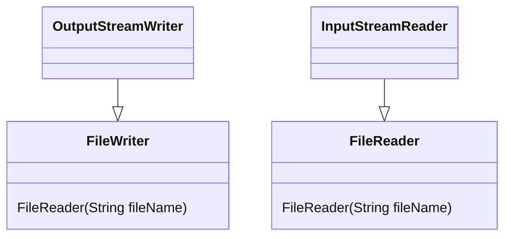
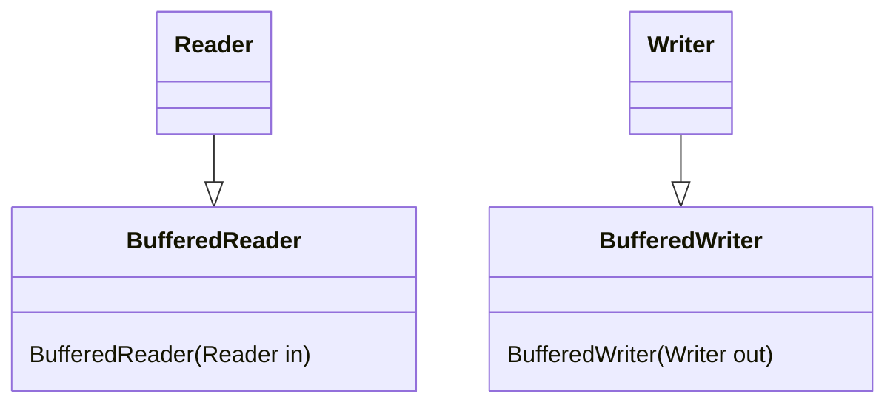
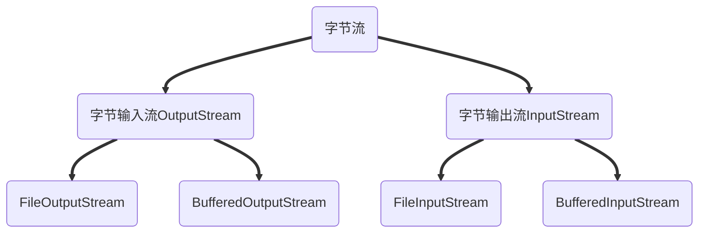
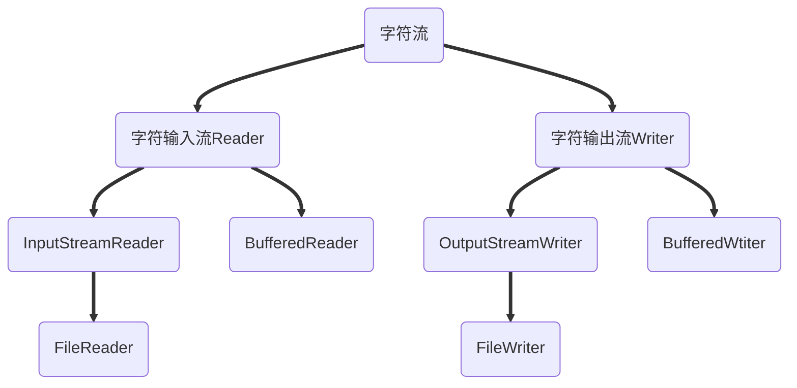
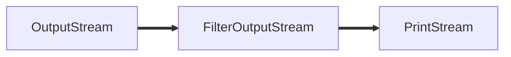
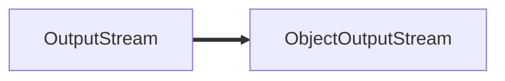
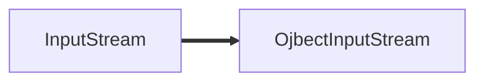
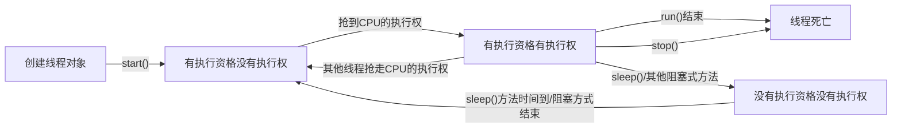
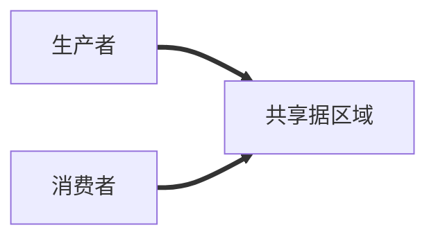

[TOC]

## 集合体系结构

### Set

#### Set集合概述和特点

Set集合特点

+ 不包含重复的元素
+ 没有带索引的方法，所以不能使用普通for循环遍历

存储对象并遍历

```java
public static void main(String[] args) {
        //创建集合对象
        Set<String> set = new HashSet<>();

        //添加元素
        set.add("hello");
        set.add("world");
        set.add("java");
        set.add("java");

        //遍历
        for(String s :set){
            System.out.println(s);
        }
        System.out.println(set);
    }
```

执行结果：

world
java
hello
[world, java, hello]

#### 哈希值

哈希值：是JDK根据对象的**地址**或者**字符串**或者**数字**算出来的int类型的**数值**

Object类中有一个方法可以获取对象的哈希值

+ public int hashCode():返回对象的哈希码值

```java
public static void main(String[] args) {
    //创建学生对象
    Student s1 = new Student("宵宫",18);

    //同一个对象多次调用hashCode()方法返回的哈希值是相同的
    System.out.println(s1.hashCode()); //2129789493
    System.out.println(s1.hashCode()); //2129789493

    Student s2 = new Student("宵宫",18);

    //默认情况下，不同对象的哈希值是不相同的
    //通过方法重写，可以实现不同对象的哈希值是相同的
    System.out.println(s2.hashCode()); //668386784

    System.out.println("hello".hashCode());//99162322
    System.out.println("world".hashCode());//113318802
    System.out.println("java".hashCode());//3254818

    System.out.println("world".hashCode());//113318802

    System.out.println("重地".hashCode());//1179395
    System.out.println("通话".hashCode());//1179395
}
```

对象的哈希值特点：

+ 同一个对象多次调用hashCode()方法返回的哈希值是相同的
+ 默认情况下，不同对象的哈希值是不同的。而重写hashCode()方法，可以实现让不同对象的哈希值相同

#### HashSet集合概述和特点

HashSet集合特点

+ 底层数据结构是哈希表
+ 对集合的迭代顺序不做任何保证，也就是说不保证存储和取出的元素顺序一致
+ 没有带索引的方法，所以不能使用普通for循环遍历
+ 由于是Set集合，所以是不包含重复元素的集合

#### 常见的数据结构之哈希表

哈希表

+ JDK8之前，底层采用**数组+链表**实现，可以说是一个元素为链表的数组
+ JDK8以后，在长度比较长的时候，底层实现了优化


#### LinkedHashSet集合概述和特点

LinkedHashSet集合特点

+ 哈希表和链表实现的Set接口，具有可预测的迭代次序
+ 有链表保证元素有序，也就是说元素的存储和取出顺序是一致的
+ 有哈希表保证元素唯一，也就是说没有重复的元素

#### TreeSet集合概述和特点

TreeSet集合特点：

+ 元素有序，这里的顺序不是指存储和取出的顺序，而是按照一定的规则进行排序，具体排序方法取决于构造方法
+ TreeSet()：根据其元素的自然顺序进行排序
+ TreeSet(Comparator comparator): 根据指定的比较器进行排序
+ 没有带索引的方法，所以不能是用普通for循环遍历
+ 由于是Set集合，所以不包含重复的元素

```java
public class TreeSetDemo {
    public static void main(String[] args) {
        //创建集合对象
        TreeSet<Integer> ts= new TreeSet<Integer>();

        //添加元素
        ts.add(10);
        ts.add(30);
        ts.add(40);
        ts.add(20);
        //遍历集合
        for (Integer i :ts){
            System.out.println(i);
        }
    }
}
```

##### 自然排序Comparable的使用

+ 存储学生对象并遍历，创建TreeSet集合使用无参构造方法
+ 要求：按照年龄从小到大排序，年龄相同时，按照姓名的字母顺序排序

```java
public static void main(String[] args) {
    //创建集合对象
    TreeSet<Student> ts = new TreeSet<Student>();

    //创建学生对象
    Student s1 = new Student("xiaogong", 18);
    Student s2 = new Student("xinhai", 20);
    Student s3 = new Student("leishen", 500);
    Student s4 = new Student("ganyu", 17);
    Student s5 = new Student("shatang",18);

    //把学生添加到集合
    ts.add(s1);
    ts.add(s2);
    ts.add(s3);
    ts.add(s4);
    ts.add(s5);

    for (Student s : ts) {
        System.out.println(s.getName() + "," + s.getAge());
    }
}
```

```java
@Override
public int compareTo(Student s) {

    //按年龄从小到大排序
    int num = this.age - s.age;
    //年龄相同时，按照姓名的字母顺序排序
    int num2 = num == 0 ? this.name.compareTo(s.name) : num;
    return num2;
}
```

结论

+ 用TreeSet集合存储自定义对象，无参构造方法使用的是**自然排序**对元素进行排序的
+ 自然排序，就是让元素所属的类实现Comparable接口，重写compareTo(To)方法
+ 重写方法是，一定要注意排序规则必须按照要求的主要条件和次要条件来写

##### 比较器排序Comparator的使用

+ 存储学生对象并遍历，创建TreeSet集合使用**带参构造方法**
+ 要求：按年龄从小到大排序，年龄相同时，按照姓名的字母顺序排序

结论

+ 用TreeSet集合存储自定义对象，带参构造方法使用的是**比较器排序**对元素进行排序的
+ 比较器排序，就是**让集合构造方法接收Comparator的实现类对象**，重写Compare(T 01,T 02)方法
+ 重写放法时，一定要注意排序规则必须按照要求的主要条件和次要条件来写

### 泛型

#### 泛型概述

泛型：是JDK5中引入的特性，它提供了编译时类型安全检测机制，该机制允许在编译时检测到非法的类型他的本质是**参数化类型**，也就是说所操作的数据类型被指定为一个参数
一提到参数，最熟悉的就是定义方法时有形参，然后调用此方法时传递实参。那么参数化类型怎么理解呢？
顾名思义，就是**将类型由原来的具体的类型参数化，然后在使用/调用时传入具体的类型**
这种参数类型可以用在类、方法、接口中，分别被称为泛型类、泛型方法、泛型接口

##### 泛型定义格式：

+ <类型>:指定一种类型的格式。这里的类型可以看成是形参
+ <类型1,类型2......>:指定多种类型的格式，多种类型之间用逗号隔开。这里的类型可以看成是形参
+ 将来具体调用时候给定的类型可以看成是实参，并且实参的类型只能是引用数据类型

##### 泛型的好处：

+ 把运行时期的问题提前到了编译期间
+ 避免了强制类型转换

#### 泛型类

泛型类的定义格式：

+ 格式：修饰符class 类名<类型>{}

+ 范例：public class Generic<T>{}
  
  ​          此处T可以随便蟹为任意表示，常见的如T、E、K、V等形式的参数通常用于表示泛型

```java
public class Generic<T> {
    private T t;

    public T getT() {
        return t;
    }

    public void setT(T t) {
        this.t = t;
    }
}
```

#### 泛型方法

泛型方法的定义格式：

+ 格式：修饰符<类型>返回值类型方法名(类型 方法名){}
+ 范例：public <T> void show(T t){}

```java
public class Generic {
    public <T> void show(T t) {
        System.out.println(t);
    }
}
```

#### 泛型接口

泛型接口定义格式：

+ 格式：修饰符 interface 接口名 <类型> {}
+ 范例：public interface Generic<T>{}

```java
public interface Generic<T> {
    void show(T t);
}

public class Genericimpl<T> implements Generic<T>{
    @Override
    public void show(T t) {
        System.out.println(t);
    }
}

public class Demo {
    public static void main(String[] args) {
        Generic<String> g1 = new Genericimpl<String>();
        g1.show("甘雨");

        Generic<Integer> g2 = new Genericimpl<Integer>();
        g2.show(30);
    }
}
```

#### 泛型通配符

为了表示各种泛型List的父类，可以使用类型通配符

+ 类型通配符：<?>
+ List<?>：表示元素类型未知List，它的元素可以匹配**任何的类型**
+ 这种带通配符的List仅表示它是各种泛型List的父类，并不能把元素添加到其中

如果说我们不希望List<?>是任何泛型List的父类，只希望它代表某一类泛型List的父类，可以使用类型通配符的上限

+ 类型通配符上线：**<? extends 类型>**
+ List<? extends Number>：它表示的类型是**Number或者其子类型**

除了可以指定类型通配符的上限，我们也可以指定类型通配符的下限

+ 类型通配符下线：**<? super 类型>**
+ List<? super Number>：它表示的类型是**Number或者其父类型**

```java
//类型通配符：<?>
List<?> list1 = new ArrayList<String>();
List<?> list2 = new ArrayList<Number>();
List<?> list3 = new ArrayList<Integer>();

System.out.println("-----------------");
//类型通配符的上限
List<? extends Number> list5 = new ArrayList<Number>();
List<? extends Number> list6 = new ArrayList<Integer>();

System.out.println("-----------------");
//类型通配符的下限
List<? super Number> list7 = new ArrayList<Object>();
List<? super Number> list8 = new ArrayList<Number>();
```

#### 可变参数

可变参数又称参数个数可变，用作方法的参数出现，那么方法参数个数就是可变的了

+ 格式：修饰符 返回值类型 方法名(数据类型...变量名){}
+ 范例：public static int sum(int...a){}

可变参数注意事项

+ 这里的变量其实是一个数组
+ 如果一个方法有多个参数，包含可变参数，可变参数要放在最后

```java
public static void main(String[] args) {
    System.out.println(sum(10,20,30));
}

public static int sum(int... a){
    int sum = 0;
    for (int i:a){
        sum +=i;
    }
    return sum;
}
```

#### 可变参数的使用

Arrays工具类中有一个静态方法：

+ public static<T> List<T> asList(T... a):返回指定数组支持的固定大小的列表
+ 返回的集合不能做增删操作，可以做修改操作

List接口中有一个静态方法：

+ public static<E> List<E> of(E... elements):返回包含任意数量的元素的不可变列表
+ 返回的集合不能做增删改操作

Set接口中有一个静态方法：

+ public static<E> Set<E> of(E... elements)：返回一个包含任意数量元素的不可变集合
+ 再给集合元素的时候，不能给重复的元素
+ 返回的集合不能做增删操作，没有修改的方法

### Map集合概述和使用

#### Map集合概述

+ Interface Map<K,V>    K：键的类型；V：值的类型
+ 将键映射到值的对象；不能包含重复的键；每个键可以映射到最多一个值
+ 举例：学生的学号和姓名

| 学号         | 姓名  |
| ---------- | --- |
| itheima001 | 宵宫  |
| itheima002 | 新海  |
| itheima003 | 砂糖  |

创建Map集合对象

+ 多态的方式
+ 具体的实现类HashMap

#### Map集合的基本功能

| 方法名                                 | 说明                 |
| ----------------------------------- | ------------------ |
| V put(K key,V value)                | 添加元素               |
| V remove(Object key)                | 根据键删除键值对元素         |
| void chear()                        | 移除多有的键值对元素         |
| boolean containsKey(Object key)     | 判断集合是否包含指定的键       |
| boolean containsValue(object value) | 判断集合是否包含指定的值       |
| boolean isEmpty()                   | 判断集合是否为空           |
| int seize()                         | 集合的长度，也就是集合中键值对的个数 |

#### Map集合的获取功能

| 方法名                            | 说明           |
| ------------------------------ | ------------ |
| V get(Object key)              | 根据键获取值       |
| Set<K> keySet()                | 获取所有键的集合     |
| Collection<V> values()         | 获取所有值的集合     |
| Set<map.Entry<K,V>> entrySet() | 获取所有键值对对象的集合 |

#### Map集合的遍历

我们存储的元素都是成对出现的，所以我们把Map看成是一个夫妻对的集合

遍历思路1：

+ 把所有的丈夫集中起来
+ 遍历丈夫的集合，获取每一个丈夫
+ 根据丈夫去找对应的妻子

转换为Map集合中的操作：

+ 获取所有键的集合。用KeySet()方法实现
+ 遍历键的集合，获取到每一键。用增强for实现
+ 根据键去找值。用get(Obeject key)方法实现

遍历思路2：

+ 获取所有结婚证的集合
+ 遍历结婚证的的集合，得到每一个接换证
+ 根据结婚证获取丈夫和妻子

转换为Map集合中的操作：

+ 获取键值对对象的集合
  + Set<Map.Entry<K,V>> entrySet()：获取所有键值对对象的集合
+ 遍历键值对对象的集合，得到每一个键值对对象
  + 用增强for实现，得到每一个Map.Entry
+ 根据键值对对象获取键和值
  + 用getkey()得到键
  + 用getValue()得到值

#### 案例：HashMap集合存储学生对象并遍历（1

需求：创建一个HashMap集合，键是学号(String)，值是学生对象(Student)。存储三个键值对元素，并遍历

思路：

1. 定义学生类、

2. 创建HashMap集合对象

3. 创建学生对象

4. 把学生添加到集合

5. 遍历集合
   
   方法1：键找值
   
   方法2：键值对对象找键和值

```java
//创建HashMap集合对象
HashMap<String, Student> hm = new HashMap<String, Student>();

//创建学生对象
Student s1 = new Student("宵宫", 18);
Student s2 = new Student("新海", 20);
Student s3 = new Student("砂糖", 16);

//把学生添加到集合
hm.put("tiwate001", s1);
hm.put("tiwate002", s2);
hm.put("tiwate003", s3);

//遍历集合
Set<String> keySet = hm.keySet();
for (String key : keySet) {
    Student value = hm.get(key);
    System.out.println(key + "," + value.getName() + "," + value.getAge());

}
```

#### 案例：HashMap集合存储学生对象并遍历（2

需求：创建一个HashMap集合，键是学生对象(Student)，值是居住地(String)存储多个键值对元素，并遍历

要求保证键的唯一性：如果学生对象的成员变量值相同，我们就认为是同一个对象

思路：

1. 定义学生类

2. 创建HashMap集合对象

3. 创建学生对象

4. 把学生添加到集合

5. 遍历集合

6. 在学生类中创协两个方法
   
   hashCode()
   
   equals()
   
   ```java
   HashMap<Student, String> hm = new HashMap<Student, String>();
   
   Student s1 = new Student("宵宫", 18);
   Student s2 = new Student("砂糖", 19);
   Student s3 = new Student("钟离", 20);
   Student s4 = new Student("钟离", 20);
   
   hm.put(s1, "稻妻");
   hm.put(s2, "蒙德");
   hm.put(s3, "璃月");
   hm.put(s4, "提瓦特");
   
   Set<Student> keySet = hm.keySet();
   
   for (Student key : keySet) {
       String value = hm.get(key);
       System.out.println(key.getName() + "," + key.getAge() + "," + value);
   }
   ```

#### 案例：ArrayList集合存储HashMap元素并遍历

需求：创建一个ArrayList集合，存储三个元素，每一个HashMap的键和值都是String，并遍历

思路：

1. 创建ArrayList集合
2. 创建HashMap集合，并添加键值对元素
3. 把HashMap作为元素添加到ArrayList集合
4. 遍历ArrayList集合

```java
//创建ArrayList集合
ArrayList<HashMap<String, String>> array = new ArrayList<HashMap<String, String>>();

//创建HashMap集合并添加键值对元素
HashMap<String, String> hm1 = new HashMap<String, String>();
hm1.put("孙策", "大乔");
hm1.put("周瑜", "小乔");
//把HashMap作为元素添加到ArrayList集合
array.add(hm1);

HashMap<String, String> hm2 = new HashMap<String, String>();
hm2.put("郭靖", "黄蓉");
hm2.put("杨过", "小龙女");
//把HashMap作为元素添加到ArrayList集合
array.add(hm2);

HashMap<String, String> hm3 = new HashMap<String, String>();
hm3.put("令狐冲", "任盈盈");
hm3.put("林平之", "岳灵珊");
//把HashMap作为元素添加到ArrayList集合
array.add(hm3);

//遍历ArrayList集合
for (HashMap<String, String> hm : array) {
    Set<String> keySet = hm.keySet();
    for (String key : keySet) {
        String value = hm.get(key);
        System.out.println(key + "," + value);
    }
}
```

#### 案例：HashMap集合存储ArrayList元素并遍历

需求：创建一个HashMap集合，存储三个键值对对象，每一个键值对元素的键是String，值是ArrayList

每一个ArrayList的元素是String，并遍历

思路：

1. 创建HashMap集合
2. 创建ArrayList集合，并添加元素
3. 把ArrayList作为元素添加到HashMap集合
4. 遍历HashMap集合 

```java
HashMap<String, ArrayList<String>> hm = new HashMap<>();

ArrayList<String> sgyy = new ArrayList<>();
sgyy.add("诸葛亮");
sgyy.add("赵云");
hm.put("三国演义", sgyy);

ArrayList<String> xyj = new ArrayList<>();
xyj.add("唐僧");
xyj.add("孙悟空");
hm.put("西游记", xyj);

ArrayList<String> shz = new ArrayList<>();
shz.add("武松");
shz.add("鲁智深");
hm.put("水浒准", shz);

Set<String> keySet = hm.keySet();
for (String key : keySet) {
    System.out.println(key);
    ArrayList<String> value = hm.get(key);
    for (String s : value) {
        System.out.println("\t" + s);
    }
}
```

#### 案例：统计字符串中每个字符出现的次数

需求：键盘录入一个字符串，要求统计字符串中每个字符出现的次数

分析

1. 我们可以把结果分成几个部分来看：a(5),b(4),c(3),d(2),e(1)

2. 每个部分可以看成是：字符和字符对应的次数组成

3. 这样的数据，我们可以通过HashMap集合来存储，键是字符，值是字符出现的次数
   
   ​        注意：键是字符，类型应该是Character；值是字符出现的次数，类型应该是Integer

思路

1. 键盘录入一个字符串
2. 创建HashMap集合，键是Character，值是Integer
3. 遍历字符串，得到每一个字符
4. 拿得到的每一个字符作为键到HashMap集合中去找对应的值，看其返回值
   1. 如果返回值是null：说明该字符在HashMap集合中不存在，就把该字符作为键，1作为值存储
   2. 如果返回值不是null：说明该字符在HashMap集合中存在，把该值加1，然后从新存储该字符和对应的值
5. 遍历HashMap集合，的到键和值，按照要求进行拼接
6. 输出结果

```java
Scanner sc = new Scanner(System.in);
System.out.println("请输入一个字符串");
String line = sc.nextLine();

HashMap<Character, Integer> hashMap = new HashMap<Character, Integer>();

for(int i=0;i<line.length();i++){
    char key = line.charAt(i);

    Integer value = hashMap.get(key);

    if (value==null){
        hashMap.put(key,1);
    }else{
        value++;
        hashMap.put(key,value);
    }
}
StringBuilder sb = new StringBuilder();
Set<Character> keySet = hashMap.keySet();
for (Character key:keySet){
    Integer value = hashMap.get(key);
    sb.append(key).append("(").append(value).append(") ");
}

String result = sb.toString();
System.out.println(result);
```

### Collections

#### Collections类的概述

+ 是针对集合操作的工具类

Collections类的常用方法

+ public static <T extends Comparable<? super T>> void sort(List<T> list):将指定的列表按升序排序
+ public static void reverse(List<?> list)：反转指定泪飙中元素的顺序
+ public static void shuffle(List<?> list)：使用默认的随机源随机排序指定的列表

```java
list.add(30);
list.add(20);
list.add(50);
list.add(10);
list.add(40);
Collections.sort(list);
System.out.println(list);   //[10, 20, 30, 40, 50]
Collections.reverse(list);
System.out.println(list);   //[50, 40, 30, 20, 10]
Collections.shuffle(list);
System.out.println(list);   //[40, 50, 10, 20, 30]
```

#### 案例：模拟斗地主

需求：通过程序实现斗地主过程中的洗牌，发牌和看牌

思路：

1. 创建一个牌盒，也就是定义1一个1集合对象，用ArrayList集合实现
2. 往牌盒里面装牌
3. 洗牌，也就是把牌打散，用Collections的shuffle()方法实现
4. 发牌，也就是遍历集合，给三个玩家发牌
5. 看牌，也就是三个玩家分别遍历自己的牌

```java
public static void main(String[] args) {
    //创建一个牌盒，也就是定义一个集合对象，用ArrayList集合实现
    ArrayList<String> array = new ArrayList<String>();

    //往牌盒里面装牌
    /*
        ♢2，♢3，♢4......♢K,♢A
        ♧2,...
        ♡2,...
        ♤2,...
        小王，大王
     */
    //定义花色数组
    String[] colors = {"♢", "♧", "♡", "♤"};
    //定义点数数组
    String[] numbers = {"2", "3", "4", "5", "6", "7", "8", "9", "10", "J", "Q", "K", "A"};
    for (String color : colors) {
        for (String number : numbers) {
            array.add(color + number);
        }
    }
    array.add("小王");
    array.add("大王");

    //洗牌
    Collections.shuffle(array);

    //发牌，给三个玩家
    ArrayList<String> user1 = new ArrayList<>();
    ArrayList<String> user2 = new ArrayList<>();
    ArrayList<String> user3 = new ArrayList<>();
    ArrayList<String> dz = new ArrayList<>();

    for (int i = 0; i < array.size(); i++) {
        String poker = array.get(i);

        if (i >= array.size() - 3) {
            dz.add(poker);
        } else if (i % 3 == 0) {
            user1.add(poker);
        } else if (i % 3 == 1) {
            user2.add(poker);
        } else if (i % 3 == 2) {
            user3.add(poker);
        }
    }

    //看牌
    lookPorker("宵宫",user1);
    lookPorker("新海",user2);
    lookPorker("彩鳞",user3);
    lookPorker("底牌",dz);
}

//看牌的方法
public static void lookPorker(String name,ArrayList<String> array){
    System.out.print(name+ "的牌是：");
    for (String poker:array){
        System.out.print(poker+ "  ");
    }
    System.out.println();

}
```

#### 案例：模拟斗地主升级版

需求：通过程序实现斗地主过程中的洗牌，看牌和发牌。要求：对牌进行排序

思路：

1. 创建HashMap，键是编号，值是牌
2. 创建ArrayList，存储编号
3. 创建花色数组和点数数组
4. 从0开始往HashMap里面存储编号，并存储对应的牌。同时往ArrayList里面存储编号
5. 洗牌(洗的是编号)，用Collections的shuffle()方法实现
6. 发牌(发的也是编号，为了保证编号是顺序的，创建TreeSet集合接收)
7. 定义方法看牌(遍历TreeSet集合，获取编号，到HashMap集合找对应的牌)
8. 调用看牌方法

```java
public static void main(String[] args) {
    //创建HashMap集合
    HashMap<Integer, String> hm = new HashMap<>();

    //创建ArrayList集合
    ArrayList<Integer> array = new ArrayList<>();

    //定义花色数组
    String[] colors = {"♢", "♧", "♡", "♤"};
    //定义点数数组
    String[] numbers = {"2", "3", "4", "5", "6", "7", "8", "9", "10", "J", "Q", "K", "A"};


    //从0开始往HashMap里面存储编号，并存储对应的牌。同时往ArrayList里面存储编号
    int index = 0;

    for (String number : numbers) {
        for (String color : colors) {
            hm.put(index, color + number);
            array.add(index);
            index++;
        }
    }
    hm.put(index, "小王");
    array.add(index);
    index++;
    hm.put(index, "大王");
    array.add(index);

    //洗牌
    Collections.shuffle(array);

    //发牌
    TreeSet<Integer> user1 = new TreeSet<>();
    TreeSet<Integer> user2 = new TreeSet<>();
    TreeSet<Integer> user3 = new TreeSet<>();
    TreeSet<Integer> dp = new TreeSet<>();

    for (int i = 0; i < array.size(); i++) {
        int x = array.get(i);
        if (i >= array.size() - 3) {
            dp.add(x);
        } else if (i % 3 == 0) {
            user1.add(x);
        } else if (i % 3 == 1) {
            user2.add(x);
        } else if (i % 3 == 2) {
            user3.add(x);
        }
    }

    //调用看牌方法
    lookPoker("user1",user1,hm);
    lookPoker("user2",user2,hm);
    lookPoker("user2",user3,hm);
    lookPoker("底牌",dp,hm);

}

public static void lookPoker(String name, TreeSet < Integer > ts, HashMap < Integer, String > hm ){
    System.out.print(name+"的牌是： ");
    for (Integer key:ts){
        String poker=hm.get(key);
        System.out.print(poker+"  ");
    }
    System.out.println();
}
```

## IO流

### File

#### File类概述和构造方法

File：它是文件和目录路径名的抽象表示

+ 文件和目录是可以通过File封装成对象的
+ 对于File而言，其封装的并不是一个真正存在的文件，仅仅是一个路径名而已。它可以是存在的，也可以是不存在的。将来是要通过具体的操作把这个路径的内容转换为具体存在的

| 方法名                              | 说明                              |
| -------------------------------- | ------------------------------- |
| File(String pathname)            | 通过将给定的路径名字符串转换为抽象路径名来创建新的File实例 |
| File(String parent,String child) | 从父路径名字符串和子路径名字符串创建新的File实例      |
| File(File parent,String child)   | 从父抽象路径名和子路径名字字符串创建新的File实例      |

```java
File f1 = new File("D:\\mc\\FileDemo\\java.txt");
System.out.println(f1);

File f2 = new File("D:\\mc\\FileDemo","java.txt");
System.out.println(f2);

File f3 = new File("D:\\mc\\FileDemo");
File f4 = new File(f3,"java.txt");
System.out.println(f4);
```

#### File类创建功能

| 方法名                            | 说明                               |
| ------------------------------ | -------------------------------- |
| public boolean createNewFile() | 当具有该名称的文件不存在时，创建一个由该抽象路径名命名的新空文件 |
| public boolean mkdir()         | 创建由此抽象路径名命名的目录                   |
| public boolean mkdirs()        | 创建由此抽象路径名名命的目录，包括任何必须但不存在的父目录下   |

```java
File f1 = new File("D:\\mc\\FileDemo\\java.txt");
System.out.println(f1.createNewFile());
//如果文件不存在，就创建文件，并返回true
//如果文件存在，就不创建文件，并返回false
//如果存在同名文件夹，不创建文件，并返回false

File f2 = new File("D:\\mc\\FileDemo\\JavaSe");
System.out.println(f2.mkdir());
//如果目录不存在，就创建目录，并返回true
//如果目录存在，就不创建目录，并返回false
//如果中间目录不存在,终止创建

File f3 = new File("D:\\mc\\FileDemo\\java\\javaSE");
System.out.println(f3.mkdirs());
//如果目录不存在，就创建目录，并返回true
//如果目录存在，就不创建目录，并返回false
```

#### File类判断和获取功能

| 方法名                             | 说明                            |
| ------------------------------- | ----------------------------- |
| public boolean isDirectory()    | 测试此抽象路径名表示的File是否为目录          |
| public boolean isFile()         | 测试此抽象路径名表示的File是否为文件          |
| public boolean exists()         | 测试此抽象路径名表示的File是否存在           |
| public String getAbsolutePath() | 返回此抽象路径名的绝对路径名字符串             |
| public String getPath           | 将此抽象路径名转换为路径名字符串              |
| public String getName()         | 返回由此抽象路径名表示的文件或目录的名称          |
| public String[] list()          | 返回此抽象路径名表示的目录中的文件和目录的名称字符串数组  |
| public File[] listFiles()       | 返回此抽象路径名表示的目录中的文件和目录的File对象数组 |

```java
File f = new File("D:\\mc\\FileDemo\\java.txt");

System.out.println(f.isDirectory());
System.out.println(f.isFile());
System.out.println(f.exists());

System.out.println(f.getAbsolutePath());
System.out.println(f.getPath());
System.out.println(f.getName());

File f2 = new File("D:\\mc\\FileDemo");
String[] strArray = f2.list();
for (String str:strArray){
    System.out.println(str);
}
System.out.println("----------------");
File[] fileArray = f2.listFiles();
for (File file:fileArray){
    System.out.println(file);
}
```

#### File类删除功能

| 方法名                     | 说明                |
| ----------------------- | ----------------- |
| public boolean delete() | 删除由此抽象路径名表示的文件或目录 |

相对路径和绝对路径的区别

+ 绝对路径：完整的路径名，不需要任何其他信息就可以定位它所表示的文件。
+ 相对路径：必须使用取自其他路径名的信息进行解释

删除目录时的注意事项

+ 如果一个**目录中有内容**（内容，文件），**不能直接删除**，应该先删除目录中的人内容，最后才能删除目录

```java
        //需求1：在当前模块下创建java.txt文件
        File f1 = new File("javaSE\\2021_11_22_IO流\\src\\FileDemo\\java1.txt");
//        System.out.println(f1.createNewFile());

        //需求2：删除当前模块目录下的java.txt文件
//        System.out.println(f1.delete());
        //需求3：在当前模块目录下创建itcast目录
        File f2 = new File("javaSE\\2021_11_22_IO流\\src\\FileDemo\\itcast");
//        System.out.println(f2.mkdir());

        //需求4：删除当前目录下的itcast
//        System.out.println(f2.delete());

        //需求5：在当前模块下创建一个itcast，然后再该目录下创建一个文件java.txt
        File f3=new File("javaSE\\2021_11_22_IO流\\src\\FileDemo\\itcast");
//        System.out.println(f3.mkdir());
        File f4=new File("javaSE\\2021_11_22_IO流\\src\\FileDemo\\itcast\\java.txt");
//        System.out.println(f4.createNewFile());

        //需求6：删除当前模块下的目录itcast
        System.out.println(f3.delete()); //只能删除空目录
```

#### 递归

递归概述：以编程的角度来看，递归指的是方法定义中调用方法本身的现象

递归解决问题的思路：

+ 把一个复杂的问题层层转化为一个**与原问题相似的规模较小**的问题来求解
+ 递归策略只需**少量的程序**就可描述出解题过程所需要的多次重复计算

递归解决问题要找两个内容：

+ 递归出口：否则会出现内存溢出
+ 递归原则：与原问题相似的规模较小的问题

#### case:Traverse diretory

案例：遍历目录

需求：给定一个路径，通过递归完成遍历该目录下的所有内容，并把所有文件的绝对路径输出在控制台

思路：

1. 根据给定的路径创建一个File对象
2. 定义一个方法，用于获取给定目录下的所有内容，参数为第一步创建的File对象
3. 获取给定的File目录下所有的文件或者目录的File数组
4. 遍历该File数组，得到每一个File对象
5. 判断该File对象是否为目录
   + 是，递归调用
   + 不是，获取绝对路径输出在控制台
6. 调用方法

```java
public static void main(String[] args) {
    File file=new File("D:\\mc\\FileDemo");
    getAllFilePath(file);
}
public static void getAllFilePath(File srcFile){
    File[] fileArray = srcFile.listFiles();
    if (fileArray !=null){
        for (File file:fileArray){
            if (file.isDirectory()){
                getAllFilePath(file);
            } else {
                System.out.println(file.getAbsolutePath());
            }
        }
    }
}
```

### IO流的概述和分类

#### IO流概述：

+ IO：输入/输出(Input/Output)

+ 流：是一种抽象概念，是对数据传输的总成，也就是说数据在设备间传输称为流，流的本质是数据传输

+ IO流就是用来出来设备间数据传输问题的
  
  ​    常见的应用：文件复制；文件上传；文件下载

#### IO流的分类：

所有的io操作最后都要释放资源

void close()：关闭此文件输出流并释放与此流相关联的任何系统资源

+ ##### 按照数据的流向
  
  + 输入流：读数据
  + 输出流：写数据

+ ##### 按照数据类型来分
  
  + 字节流
    
    字节输入流；字节输出流
  
  + 字符流
    
    字符输入流；字符输出流

一般来说，我们说IO流的分类是按照**数据类型**来分的

### 字节流

字节流抽象基类：

+ InputStream：所有字节输入流的超类
+ OutputStream：所有字节输出流的超类
+ 子类名特点：子类名称都是以其父类名作为子类名的后缀

#### 字节流写数据

​    FileOutputStream

| 方法                                    | 说明                                               |
| ------------------------------------- | ------------------------------------------------ |
| FileOutputStream(String name)         | 创建文件输出流以指定名称写入文件                                 |
| void write(int b)                     | 将指定字节写入此文件输出流                                    |
| void write(byte[] b)                  | 将b.length字节从指定的字节数组写入此文件输出流                      |
| void write(byte[] b,int off, int len) | 将len字节从指定的字节数组开始，从偏移量off开始写入此文件输出流一次写一个字节数组的部分数据 |

使用字节输出流写数据的步骤：

+ 创建字节输出流对象（调用系统功能创建了文件，创建字节输出流对象，让字节输出流对象指向文件）
+ 调用字节输出流对象的写数据方法
+ 释放资源(关闭此文件输出流并释放与此流相关联的任何系统资源)

```java
FileOutputStream fos =new FileOutputStream("javaSE\\2021_11_22_IO流\\src\\FileOutputStreamDemo\\fos.txt");
/*
    做了三件事
        1：调用系统功能创建了文件
        2：创建了字节输出流对象
        3：让字节输出流对象指向创建好的对象
 */
fos.write(97);  //a

byte[] bys={97,98,99,100,101};
fos.write(bys); //abcde

byte[] bytes = "abcde".getBytes(StandardCharsets.UTF_8);
fos.write(bytes); //abcde

fos.write(bys,1,3); //bcd

fos.close();
```

String类方法:

| 方法                 | 说明           |
| ------------------ | ------------ |
| byte[] getBytes()： | 返回字符串对应的字节数组 |

##### 字节流写数据的两个小问题

###### 字节流写数据如何实现换行

+ 写完数据后，加换行符
  + windows:\r\n
  + linus:\n
  + mac:\r

```java
for (int i=0;i<10;i++){
    fos.write("hello".getBytes(StandardCharsets.UTF_8));
    fos.write("\n".getBytes(StandardCharsets.UTF_8));
}
```

###### 字节流写数据如何实现追加写入

+ public FileOutputStream(String name,boolean append)
+ 创建文件输出流以指定的名称写入文件。如果第二个参数为true，则表示字节将写入文件的末尾而不是开头

```java
FileOutputStream fos =new FileOutputStream("javaSE\\2021_11_22_IO流\\src\\FileOutputStreamDemo\\fos.txt",true);
```

##### 字节流写数据加异常处理

finally：在异常处理时提供finally块来执行所有清楚操作。比如说IO流中释放资源

特点：被finally控制的语句一定会执行，除非JVM退出

```java
try{
    可能出现异常的代码;
}catch(异常类名 变量名){
    异常的处理代码;
}finally{
    执行所有清楚操作;
}
```

```java
FileOutputStream fos = null;
try {
    fos = new FileOutputStream("javaSE\\2021_11_22_IO流\\src\\FileOutputStreamDemo\\fos.txt", true);
    fos.write("hello".getBytes(StandardCharsets.UTF_8));
} catch (IOException e) {
    e.printStackTrace();
} finally {
    if (fos !=null) {
        try {
            fos.close();
        } catch (IOException e) {
            e.printStackTrace();
        }
    }
}
```

#### 字节流读数据

需求：把文件fos.txt中的内容读取出来在控制台输出

使用字节输入流读取数据的步骤：

1. 创建字节输入流对象
2. 调用字节输入流对象的读数据方法
3. 释放资源

| 方法                                    | 说明                                                     |
| ------------------------------------- | ------------------------------------------------------ |
| FileInputStream(String name)          | 通过打开与实际文件的连接来创建一个FileInputStream,该文件由文件系统中的路径名 name命名。 |
| int read()                            | 从该输入流读取一个字节的数据                                         |
| int read(byte[] b)                    | 从该输入流读取最多 b.length个字节的数据到一个字节数组                        |
| int read(byte[] b, int off, int len)! | 从该输入流读取最多len个字节的数据到字节数组                                |

```java
        //调用字节输入流对象的读数据方法
//        int by = fis.read();
//        System.out.println(by); //97
//        System.out.println((char)by); //a
//        int by2 = fis.read(); //98
//        System.out.println(by2);
//        int by3 = fis.read(); //98
//        System.out.println(by3); //-1
        //如果达到文件的末尾返回-1
        int by;
        while ((by=fis.read()) != -1){
            System.out.print((char) by);
        }

        //释放资源
        try {
            fis.close();
        } catch (IOException e) {
            e.printStackTrace();
        }
```

```java
    //String(byte[] bytes,int offset,int length)
    public static void main(String[] args) throws IOException {
        FileInputStream fis = new FileInputStream("javaSE\\2021_11_22_IO流\\src\\FileInputStreamDemo\\fos.txt");

        byte[] bys = new byte[5];

//        int len = fis.read(bys); //第一次读取
//        System.out.println(new String(bys)); //hello
//        System.out.println(len);
//        len = fis.read(bys);
//        System.out.println(new String(bys));
//        /* 第二次读取
//        /r/n
//        wor
//         */
//        len = fis.read(bys);
//        System.out.println(new String(bys));
//        /*
//        ld
//        j
//         */
        int len;
        while((len=fis.read(bys))!=-1){
            System.out.print(new String(bys,0,len));
        }
        fis.close();
    }
```

##### Case：复制文本文件

分析：

1. 复制文本文件，其实就是把文本文件的内容从一个文件中读取出来(数据源)，然后写到另一个文本中(目的地)
2. 数据源：javaSE\\2021_11_22_IO流\\src\\FileInputStreamDemo\\a.txt
3. 目的地：javaSE\\2021_11_22_IO流\\src\\FileInputStreamDemo\\b.txt

思路：

1. 根据数据流创建字节流输入对象
2. 根据目的地创建字节输出流对象
3. 读写数据，复制文本文件(一次读取一个字节，一次写入一个字节)
4. 释放资源 

```java
public static void main(String[] args) throws IOException {
    //根据数据源创建字节输入流对象
    FileInputStream fis = new FileInputStream("javaSE\\2021_11_22_IO流\\src\\FileInputStreamDemo\\a.jpg");

    //根据目的创建字节  输出流对象
    FileOutputStream fos = new FileOutputStream("javaSE\\2021_11_22_IO流\\src\\FileInputStreamDemo\\b.jpg");

    //读写数据，复制文本文件(一次读取一个字节，一次写入一个字节)
    int by;
    while((by=fis.read())!=-1){
        fos.write(by);
    }
    //释放资源
    fos.close();
    fis.close();
}
```

#### 字节缓冲流

+ 字节缓冲流**仅仅提供缓冲区**，而真正的读写数据还得依靠基本的字节流对象进行操作

BufferedOutputStream：该类实现缓冲输出流。通过设置这样的输出流，应用程序可以向底层输出流写入字节，而不必为写入的每个字节导致底层系统的调用

| 方法名                                    | 说明                         |
| -------------------------------------- | -------------------------- |
| BufferedOutputStream(OutputStream out) | 创建一个新的缓冲输出流，以将数据写入指定的底层输出流 |

BufferedInputStream：创建BufferedInputStream将创建一个内部缓冲区数组。每当从流中读取或跳过字节时，内部缓冲区将根据需要从所包含的输入流中重新填充，一次很多字节

| 方法名                                 | 顺明                                       |
| ----------------------------------- | ---------------------------------------- |
| BufferedInputStream(InputStream in) | 创建一个BufferedInputStream并保存其参数，输入流in供以后使用 |

```java
    public static void main(String[] args) throws IOException {
//        FileOutputStream fos=new FileOutputStream("javaSE\\2021_11_22_IO流\\src\\BufferStreamDemo\\fos.txt");
//        BufferedOutputStream bos = new BufferedOutputStream(fos);
        BufferedOutputStream bos = new BufferedOutputStream(new FileOutputStream("javaSE\\2021_11_22_IO流\\src\\BufferStreamDemo\\fos.txt"));
        bos.write("hello\r\n".getBytes(StandardCharsets.UTF_8));
        bos.write("world\r\n".getBytes(StandardCharsets.UTF_8));
        bos.close();

        BufferedInputStream bis  = new BufferedInputStream(new FileInputStream("javaSE\\2021_11_22_IO流\\src\\BufferStreamDemo\\fos.txt"));

        //一次读取一个字节数据
//        int by;
//        while((by=bis.read())!=-1){
//            System.out.print((char)by);
//        }
        //一次读一个字节数组
        byte[] bys = new byte[1024];
        int len;
        while((len=bis.read(bys))!=-1){
            System.out.print(new String(bys));
        }
        bis.close();
    }
```

### 字符流

由于字节流操作中文不是特别的方便，所以java就提供字符流

+ 字符流=字节流+编码表

**字符流抽象基类**

+ Reader：字符输入流的抽象类
+ Writer：字符输出流的抽象类

**字符流中的编码解码问题相关的两个类**

+ InputStreamReader

| 方法名                                                   | 说明                            |
| ----------------------------------------------------- | ----------------------------- |
| InputStreamReader(InputStream in)                     | 创建一个使用默认字符集的InputStreamReader |
| InputStreamReader(InputStream in, String charsetName) | 创建一个使用命名字符集的InputStreamReader |

+ OutputStreamWriter

| 方法名                                                      | 说明                              |
| -------------------------------------------------------- | ------------------------------- |
| OutputStreamWriter(OutputStream out)                     | 创建一个使用默认字符编码的OutputStreamWriter |
| OutputStreamWriter(OutputStream out, String charsetName) | 创建一个使用命名字符集的OutputStreamWriter  |

```java
OutputStreamWriter osw = new OutputStreamWriter(new FileOutputStream("javaSE\\2021_11_22_IO流\\src\\CharacterStream\\fos.txt"),"GBK");
osw.write("中国");
osw.close();

InputStreamReader isr = new InputStreamReader(new FileInputStream("javaSE\\2021_11_22_IO流\\src\\CharacterStream\\fos.txt"),"GBK");
//一次读一个字符数据
int ch;
while((ch=isr.read())!=-1){
    System.out.println((char) ch);
}
isr.close();
```

#### 字符流写数据的5种方法

| 方法名                                       | 说明         |
| ----------------------------------------- | ---------- |
| void write(int c)                         | 写一个字符      |
| void write(char[] cbuf)                   | 写入一个字符数组   |
| void write(char[] cbuf, int off, int len) | 写入字符数组的一部分 |
| void write(String str)                    | 写一个字符串     |
| void write(String str, int off, int lenj) | 写一个字符串的一部分 |
| void flush()                              | 刷新流        |
| void close()                              | 关闭流，先刷新    |

```java
OutputStreamWriter osw = new OutputStreamWriter(new FileOutputStream("javaSE\\2021_11_22_IO流\\src\\CharacterStream\\fos.txt"));

osw.write(97);

char[] chs = {'a','b','c'};
osw.write(chs,0,chs.length);
osw.write("abcde");
osw.close();
```

#### 字符流读数据的2种方法

| 方法名                   | 说明          |
| --------------------- | ----------- |
| int read()            | 一次读一个字符数据   |
| int read(char[] cbuf) | 一次读一个字符数组数据 |

```java
        InputStreamReader isr = new InputStreamReader(new FileInputStream("javaSE\\2021_11_22_IO流\\src\\CharacterStream\\fos.txt"));

//        int hc;
//        while((hc=isr.read())!=-1){
//            System.out.print((char) hc);
//        }

        char[] chs=new char[1024];
        int len;
        while((len=isr.read(chs)) !=-1){
            System.out.print(new String(chs));
        }

        isr.close();
```

#### case:字符流复制java文件



FileReader  用于读取字符文件的便携类 

| 方法名                         | 说明                           |
| --------------------------- | ---------------------------- |
| FileReader(String fileName) | 创建一个新的FileReader,给定要读取的文件的名称 |

FileWriter  用于写入字符文件的便携类

| 方法名                         | 说明                      |
| --------------------------- | ----------------------- |
| FileWriter(String fileName) | 构建一个给定文件名的FileWriterd对象 |

思路：

1. 根据数据源创建字符输入流对象
2. 根据目的地创建字符输出流对象
3. 读写数据，复制文件
4. 释放资源

```java
public static void main(String[] args) throws IOException {
    //1.根据数据源创建字符输入流对象
    FileReader fr = new FileReader("javaSE\\2021_11_22_IO流\\src\\CharacterStream\\javaDemo.java");
    //2.根据目的地创建字符输出流对象
    FileWriter fw = new FileWriter("javaSE\\2021_11_22_IO流\\src\\CharacterStream\\javaCopy.java");

    //读写数据,复制文件
    int ch;
    char[] chs= new char[1024];
    while((ch = fr.read(chs))!=-1){
        fw.write(chs,0,ch);
    }

    //释放资源
    fw.close();
    fr.close();
}
```

#### 字符缓冲流



BufferedReader

| Constructor                       | 概述                     |
| --------------------------------- | ---------------------- |
| BufferedReader(Reader in)         | 创建使用默认大小的输入缓冲区的缓冲字符输入流 |
| BufferedReader(Reader in, int sz) | 创建使用指定大小的输入缓冲区的缓冲字符输入流 |

BufferedWriter

| Constructor                        | 概述                        |
| ---------------------------------- | ------------------------- |
| BufferedWriter(Writer out)         | 创建使用默认大小的输出缓冲区的缓冲字符输出流    |
| BufferedWriter(Writer out, int sz) | 创建一个新的缓冲字符输出流，使用给定大小输出缓冲区 |

默认值足够大，可用于大多数用途

```java
public static void main(String[] args) throws IOException {
    BufferedWriter bw = new BufferedWriter(new  FileWriter("javaSE\\2021_11_22_IO流\\src\\CharacterStream\\fos.txt"));
    bw.write("hello\r\nworld");
    bw.close();

    BufferedReader br = new BufferedReader(new FileReader("javaSE\\2021_11_22_IO流\\src\\CharacterStream\\fos.txt"));

    int len;
    char[] chs = new char[1024];
    while ((len=br.read(chs)) != -1){
        System.out.print(new String(chs,0,len));
    }


    br.close();
}
```

#### 字符缓冲流特有功能

BufferedWriter

| 方法名            | 概述                     |
| -------------- | ---------------------- |
| void newLine() | 写一行行分隔符，行分隔符字符串由系统属性定义 |

BufferedReader

| 方法名                      | 概述                                            |
| ------------------------ | --------------------------------------------- |
| public String readLine() | 读一行文字。结果包含行的内容的字符串，不包括任何行种植字符，如果流的结尾到达，则为null |

```java
BufferedWriter bw = new BufferedWriter(new FileWriter("javaSE\\2021_11_22_IO流\\src\\CharacterStream\\fos.txt"));

for (int i=0;i<10;i++){
    bw.write("hello");
    bw.newLine();
    bw.flush();
}
bw.close();

BufferedReader br = new BufferedReader(new FileReader("javaSE\\2021_11_22_IO流\\src\\CharacterStream\\fos.txt"));

String line;
while ((line=br.readLine())!=null){
    System.out.println(line);
}


br.close(
```

### IO流小节



**字节流可以复制任意文件数据，有4种方式一边采用字节缓冲流一次读一个字节数组的方式**



**字符流只能复制文本数据，有5种方法，一般采用字符缓冲流的特有功能**

#### case:ArrayListToTxt

需求：把ArrayList集合中的学生数据写入到文本文件。要求：每一个学生对象的数据作为文件中的一行数据

格式：学号，姓名，年龄，居住地     

思路：

1. 定义学生类
2. 创建ArrayList集合
3. 创建学生对象
4. 把学生对象添加到集合中
5. 创建字符缓冲输出流对象
6. 遍历集合，得到每一个学生对象
7. 把学生对象的数据拼接成指定格式的字符串
8. 调用字符缓冲输出流对象的方法写数据
9. 释放资源

```java
public static void main(String[] args) throws IOException {
    ArrayList<Student> array = new ArrayList<>();

    Student s1 = new Student("001", "温迪", 16, "蒙德");
    Student s2 = new Student("002", "钟离", 20, "璃月");
    Student s3 = new Student("003", "新海", 15, "稻妻");
    Student s4 = new Student("004", "甘雨", 18, "璃月");

    array.add(s1);
    array.add(s2);
    array.add(s3);
    array.add(s4);

    BufferedWriter bw = new BufferedWriter(new FileWriter("javaSE\\FileDemo\\ArrayListToTxt.txt"));
    for (Student s : array) {
        StringBuilder sb = new StringBuilder();
        sb.append(s.getId()).append(",").append(s.getName()).append(",").append(s.getAge()).append(",").append(s.getAddress());

        bw.write(sb.toString());
        bw.newLine();
        bw.flush();
    }

    bw.close();
}
```

#### case:TxtToArrayList

需求：把文本文件中的数据读取到集合中，并遍历集合。要求：文件中每一行数据是一个学生对象的成员变量值

思路：

1. 定义学生类
2. 创建字符缓冲输入流对象
3. 创建ArrayList集合对象
4. 调用字符缓冲输入流对象的方法读数据
5. 把读取到的字符串数据用split()进行分割，得到一个字符串数组
6. 创建学生对象
7. 把字符串数组中的每一个元素取出来对应的赋值给学生对象的成员变量
8. 把学生对象添加到集合
9. 释放资源
10. 遍历集合

```java
public static void main(String[] args) throws IOException {
    BufferedReader br = new BufferedReader(new FileReader("javaSE\\FileDemo\\ArrayListToTxt.txt"));

    ArrayList<Student> array = new ArrayList<>();

    String line;
    while ((line = br.readLine()) != null) {
        String[] strarray = line.split(",");

        Student s = new Student(strarray[0], strarray[1], Integer.parseInt(strarray[2]), strarray[3]);

        array.add(s);

    }

    br.close();

    for (Student s : array) {
        System.out.println(s.getId() + "," + s.getName() + "," + s.getAge() + "," + s.getAddress());

    }
}
```

#### case:TreeSetToTxt

需求：键盘录入5个学生信息(姓名，语文成绩，数学成绩，英语成绩)。要求按照总分从高到低写入文本文件

格式：姓名，语文成绩，数学成绩，英语成绩

思路

1. 定义学生类
2. 创建TreeSet集合，通过比较器排序进行排序
3. 键盘录入学生数据
4. 创建学生对象，把键盘录入的数据对应赋值给学生对象的成员变量
5. 吧学生对象添加到TreeSet集合
6. 创建字符缓冲输出流对象
7. 遍历集合，得到每一个学生对象
8. 把学生对象的数据拼接成指定格式的字符串
9. 调用字符缓冲输出流对象的方法写数据
10. 释放资源 

```java
public static void main(String[] args) throws IOException {
    TreeSet<Student> ts = new TreeSet<>(new Comparator<Student>() {
        @Override
        public int compare(Student s1, Student s2) {
            int num = s2.getSum() - s1.getSum();
            int num2 = num == 0 ? s1.getChinese() - s2.getChinese() : num;
            int num3 = num2 == 0 ? s1.getMath() - s2.getMath() : num2;
            int num4 = num3 == 0 ? s1.getName().compareTo(s2.getName()) : num3;
            return num4;
        }
    });

    for (int i = 0; i < 5; i++) {
        Scanner sc = new Scanner(System.in);
        System.out.println("请录入第" + (i + 1) + "个学生");
        System.out.println("姓名：");
        String name = sc.nextLine();
        System.out.println("语文成绩：");
        int chinese = sc.nextInt();
        System.out.println("数学成绩：");
        int math = sc.nextInt();
        System.out.println("英语成绩：");
        int english = sc.nextInt();

        Student s = new Student();
        s.setChinese(chinese);
        s.setMath(math);
        s.setEnglish(english);
        s.setName(name);

        ts.add(s);
    }

    BufferedWriter bw = new BufferedWriter(new FileWriter("javaSE\\FileDemo\\TreeSetToTxt"));

    for (Student s:ts){
        StringBuilder sb= new StringBuilder();
        sb.append(s.getName()).append(",").append(s.getChinese()).append(",").append(s.getMath()).append(",").append(s.getEnglish()).append(",").append(s.getSum());
        bw.write(sb.toString());
        bw.newLine();
        bw.flush();
    }
    bw.close();

}
```

#### case:CopyFolders

 思路：

1. 创建数据源File对象
2. 创建目的地File对象
3. 写方法实现文件夹的复制，参数为数据源File对象和目的地File对象
4. 判断数据源File是否为目录
   1. 是
      1. 在目的地下创建和数据源File同名目录
      2. 获取数据源File下所有文件或者目录的File数组
      3. 遍历该File数组，得到每一个File对象
      4. 把该File作为数据源File对象，递归调用复制文件夹的方法
   2. 不是：说明是文件，直接复制

```java
public static void main(String[] args) throws IOException{
    //创建数据源对象
    File srcFile = new File("javaSE\\FileDemo");
    //创建目的地对象
    File destFile = new File("javaSE\\FileDemo01\\");

    //写方法实现文件夹的复制，参数为数据源File对象和目的地File对象
    copyFolder(srcFile, destFile);
}

//复制文件夹
private static void copyFolder(File srcFile, File destFile) throws IOException {
    //判断数据源File是否是目录
    if (srcFile.isDirectory()){
        //在目的地创建和数据源File同名目录
        String srcFileName = srcFile.getName();
        File newFolder = new File(destFile,srcFileName);
        if (!newFolder.exists()){
            newFolder.mkdir();
        }
        //获取数据源File下所有文件或者目录的File数组
        File[] fileArray = srcFile.listFiles();

        //遍历该File数组，得到每一个File对象
        for (File file :fileArray){
            //把该File作为数据源File对象，递归调用复制文件夹的方法
            copyFolder(file,newFolder);
        }
    }else {
        File newFile =new File(destFile,srcFile.getName());
        copyFile(srcFile,newFile);
    }
}

//字节缓冲流复制文件
private static void copyFile(File srcFile, File desFile) throws IOException{
    BufferedInputStream bis = new BufferedInputStream(new FileInputStream(srcFile));
    BufferedOutputStream bos = new BufferedOutputStream(new FileOutputStream(desFile));

    byte[] bys = new byte[1024];
    int len;
    while ((len=bis.read(bys))!=-1){
        bos.write(bys,0,len);
    }

    bos.close();
    bis.close();
}
```

#### 复制文件的异常处理

try...catch...finally的做法：

```java
try{
    可能出现异常的代码;
}catch(异常类名 变量名){
    异常的处理代码;
}finally{
    执行所有清除操作;
}
```

```java
private static void method1() {
    FileReader fr = null;
    FileWriter fw = null;
    try {
        fr = new FileReader("javaSE\\java");
        fw = new FileWriter("javaSE\\java");

        char[] chs = new char[1024];
        int len;
        while ((len = fr.read(chs)) != -1) {
            fw.write(chs, 0, len);
        }

        fr.close();
        fw.close();
    } catch (IOException e) {
        e.printStackTrace();
    } finally {
        if(fw!=null) {
            try {
                fr.close();
            } catch (IOException e) {
                e.printStackTrace();
            }
        }
        if(fw!=null){
            try {
                fw.close();
            } catch (IOException e) {
                e.printStackTrace();
            }
        }
    }

}
```

**JDK7改进方案**

**自动释放资源**

```java
try(定义流对象){
    可能发生异常的代码;
}catch(异常类名 变量名){
    异常的处理代码;
}
```

```java
private static void method2(){
    try(FileReader fr = new FileReader("javaSE\\java");
        FileWriter fw = new FileWriter("javaSE\\java");
    ){

        char[] chs = new char[1024];
        int len;
        while ((len = fr.read(chs)) != -1) {
            fw.write(chs, 0, len);
        }
    }catch(IOException e){
        e.printStackTrace();
    }
}
```

**JDK9改进方案**

**自动释放资源 **

```java
定义输入流对象;
定义输出流对象;
try(输入流对象; 输出流对象){
    可能出现异常的代码
}catch(异常类名 变量名){
    异常的处理代码
}
```

```java
private static void method3() throws IOException {
    FileReader fr = new FileReader("javaSE\\java");
    FileWriter fw = new FileWriter("javaSE\\java");
    try (fr; fw) {
        char[] chs = new char[1024];
        int len;
        while ((len = fr.read(chs)) != -1) {
            fw.write(chs, 0, len);
        }
    } catch (IOException e) {
        e.printStackTrace();
    }
}
```

### 特殊操作流

#### 标准输入输出流

 System类中有两个静态的成员变量：

+ public static final InputStream in：
  
  标准输入流。通常该流对应于键盘输入或由主机环境或用户指定的另一个输入源

+ public static final PrintStream out：
  
  标准输出流。通常该流对应于显示输出或由主机环境或用户指定的另一个输出目标

自己实现键盘录入数据

##### System.in

```java
BufferedReader br =new BufferedReader(new InputStreamReader(System.in));
```

写起来太麻烦了，java就提供了一个类实现键盘录入

```java
Scanner sc = new Scanner(System.in);
```

```java
InputStream is = System.in;

/**
int len;
byte chs[] = new byte[1024];
while((len=is.read(chs))!=-1){
    System.out.print(new String(chs,0,len));
}
 */

/**
int by;
while((by=is.read())!=-1){
    System.out.println((char) by);
}

//如何把字节流转换为字符流？用转换流
InputStreamReader isr = new InputStreamReader(is);
//使用字符流能不能够实现一次读取一行数据呢？可以
//但是，一次读取一行数据的方式是字符缓冲输入流的特有方法
BufferedReader br =new BufferedReader(isr);
 */

BufferedReader br =new BufferedReader(new InputStreamReader(System.in));
System.out.println("请输入一个字符串：");
String line = br.readLine();
System.out.println("你输入的字符串是："+line);

System.out.println("请输入一个整数：");
int i = Integer.parseInt(br.readLine());
System.out.println("你输入的整数是："+i);

//自己实现键盘录入数据太麻烦了，所以java提供了一个类提供使用
Scanner sc = new Scanner(System.in);
```

##### System.out

能够方便地打印各种数据值

System.out本质是一个字节输出流

```java
PrintStream ps = System.out;
```

#### 打印流

+ 字节打印流：PrintStream



+ 字符打印流：PrintWriter


PrintStream

| Constructor                  | 概述              |
| ---------------------------- | --------------- |
| PrintStream(String fileName) | 使用指定的文件名创建新的打印流 |

 **如果使用继承父类的方法写数据，查看的时候会转码；使用自己的特有方法写数据，查看的数据原样输出**

printWriter

| Constructor                                | 概述                                  |
| ------------------------------------------ | ----------------------------------- |
| PrintWriter(String fileName)               | 使用指定的文件创建一个新的PrintWriter,而不需要自动执行刷新 |
| printWriter(Writer out, boolean autoFlush) | 创建一个新的PrintWriter                   |

autoFlush：一个布尔值，如果为真，则println，print，或format方法将刷新输出缓冲区

```java
PrintWriter pw = new PrintWriter("javaSE\\FileDemo\\java");
pw.write("hello");
pw.flush();
pw.println("hello");
pw.flush();
pw.close();
PrintWriter pw1 = new PrintWriter(new FileWriter("javaSE\\FileDemo\\java"),true);
pw1.println("hello");
```

case：复制java文件（打印流改进

思路：

1. 根据数据源创建字符输入流对象
2. 根据目的地创建字符输出流对象
3. 读写数据，复制文件
4. 释放资源

```java
        BufferedReader br = new BufferedReader(new FileReader("javaSE\\FileDemo\\java"));

        //BufferedWriter bw = new BufferedWriter(new FileWriter("javaSE\\FileDemo\\java01"));
        PrintWriter pw = new PrintWriter(new FileWriter("javaSE\\FileDemo\\java01"),true);
        String line;
        while((line=br.readLine())!=null){
            pw.println(line);
        }

        br.close();
        pw.close();
```

#### 对象序列化流

对象序列化：就是将对象保存到磁盘中，或者在网络中传输对象

这种机制就是实用一个字节序列表示一个对象，该字节序列包含：对象的类型、对象的数据和对象中存储的属性等信息

字节序列写到文件之后，相当于文件中持久存储了一个对象信息

反之，该字节序列还可以从文件中读取出来，重构对象，对他进行反序列化

要实现序列化和反序列化就要使用对象序列化流和对象反序列化流

NotSerializableException

抛出实例需要一个Serializable接口。序列化运行时或实例的类可能会抛出异常。参数应该是类的名称

类的序列化由实现java.io.Serializable接口的类启用。不实现此接口的类将不会使任何状态序列化或反序列化

+ 一个对象想要被序列化，该对象所属的类必须实现Serializable接口
+ Serializable是一个标记接口，实现该接口，不需要重写任何方法

##### 对象序列化流：ObjectOutputStream

+ 将java对象的原始数据类型和图形写入OutputStream。可以使用ObjectInputStream读取(重构)对象。可以通过使用流的文件来实现对象的持久存储。如果流是网络套接字流，则可以在另一个主机上或另一个进程中重构对象



| 方法                                   | 描述                                       |
| ------------------------------------ | ---------------------------------------- |
| ObjectOutputStream(OutputStream out) | 创建一个写入指定的OutputStream的ObjectOutputStream |
| void writeObject(Object obj)         | 将指定的对象写入ObjectOutputStream               |

```java
ObjectOutputStream oos = new ObjectOutputStream(new FileOutputStream("javaSE\\FileDemo\\ObjcetStream.txt"));

//创建对象
Student s = new Student("宵宫", 18);

oos.writeObject(s);

oos.close();
```

##### 对象反序列化流：ObjectInputStream

+ ObjectInputStream反序列化先前使用ObjectOutputStream编写的原始数据和对象



| 方法                                 | 描述                                   |
| ---------------------------------- | ------------------------------------ |
| ObjectInputStream(InputStream in ) | 创建指定的InputStream读取的ObjectInputStream |
| Object readObject()                | 从ObjectInputStream读取一个“非共享”对象。       |

```java
ObjectInputStream ois = new ObjectInputStream(new FileInputStream("javaSE\\FileDemo\\ObjcetStream.txt"));

Object ob = ois.readObject();
Student s = (Student) ob;
System.out.println(s.getName()+","+ s.getAge());

ois.close();
```

**java.io.InvalidClassException**

当序列化运行时检测到类中的以下问题之一时抛出

+ 类的串行版本与从流中读取的类描述符的类型不匹配
+ 该类包含位置的数据类型
+ 该类没有可访问的无参数构造函数

##### **常见问题**

用对象序列化流序列化了一个对象后，加入我们修改了对象所属的类文件，读取数据会不会出问题？

+ 会出问题，抛出InvalidClassException异常

如果出问题了，如何解决问题

+ 给对象所属的类加一个serialVersionUID
  
  ```java
  private  static final long serialVersionUID= 42L;
  ```

如果一个对象中的某个成员变量值不想被序列化，如何实现

+ 给该成员变量加transient关键字修饰，该关键字标记的成员变量不参与序列化过程

#### Properties

Properties概述：

+ 是一个Map体系的集合类
+ Properties可以保存到流中或从流中加载

```java
public static void main(String[] args) {
    //创建集合对象
    Properties prop = new Properties();
    prop.put("001","李青");
    prop.put("002","安妮");

    Set<Object> keyset = prop.keySet();
    for (Object key : keyset){
        Object value = prop.get(key);
        System.out.println(key +","+value);
    }
}
```

Properties作为集合的特有方法

| 方法名                                          | 说明                                     |
| -------------------------------------------- | -------------------------------------- |
| Object setProperty(String key, String value) | 设置集合的键和值，都是String类型，底层调用Hashtable方法put |
| String getProperty(String key)               | 使用此属性列表中指定的键搜索属性                       |
| Set<String> stringPropertyNames()            | 从该属性列表中返回一个不可修改的键集，其中键及其对应的值是字符串       |

```java
public static void main(String[] args) {
    //创建集合对象
    Properties prop=new Properties();

    prop.setProperty("001","宵宫");
    System.out.println(prop.getProperty("001"));//宵宫

    Set<String> names = prop.stringPropertyNames();
    for (String key:names){
        System.out.println(key);//001
    }

    System.out.println(prop);//{001=宵宫}
}
```

##### Properties和IO流结合的方法

| 方法名                                           | 说明                                                               |
| --------------------------------------------- | ---------------------------------------------------------------- |
| void load(InputStream inStream)               | 从输入字节流读取属性列表(键和元素对)                                              |
| void load(Reader reader)                      | 从输入字节流读取属性列表(键和元素对)                                              |
| void stroe(OutputStream out, String comments) | 将此属性列表(键和元素对)写入此Properties表中，以适合于使用load(InputStream)方法的格式写入输出字符流 |
| void store(Writer writer, String comments)    | 将此属性列表(键和元素对)写入此Properties表中，以适合于使用load(Reader)方法的格式写入输出字符流      |

```java
public static void main(String[] args) throws IOException {
    //把集合中的数据保存到文件
    myStore();
    //把文件中的数据加载到集合
    myLoad();
}

private static void myLoad() throws IOException {
    Properties porp = new Properties();

    FileReader fr = new FileReader("javaSE\\FileDemo\\fw.txt");

    porp.load(fr);
    fr.close();

    System.out.println(porp);
}

private static void myStore() throws IOException {
    Properties prop = new Properties();

    prop.setProperty("001", "宵宫");
    prop.setProperty("002", "砂糖");
    prop.setProperty("003", "甘雨");

    FileWriter fw = new FileWriter("javaSE\\FileDemo\\fw.txt");
    prop.store(fw, null);
    fw.close();
}
```

case:游戏次数

思路：

+ 写一个游戏，里面有一个猜数字的小游戏
+ 写一个测试类，测试类中有main()方法中按照下面步骤完成：
  + A：从文件中读取到Properties集合，用load()方法实现
    + 文件已经存在：game.txt
    + 里面有一个数据值：count=0
  + B：通过Properties集合获取到玩游戏的次数
  + C：判断次数是否到3次了
    + 如果到了，给出提示：游戏试玩已结束，想玩请充值
    + 如果不到3次：
      + 玩游戏
      + 次数+1，重写回文件，用Properties的store()方法实现

```java
public class GuessNumber {
    private GuessNumber(){
    }

    public static void start(){

        Random r =new Random();
        int number = r.nextInt(100)+1;

        while (true){
            Scanner sc = new Scanner(System.in);

            System.out.println("请输入你要踩的数字：");
            int guessNumber = sc.nextInt();

            if(guessNumber >number){
                System.out.println("你猜的数字是: "+guessNumber+"大了");
            }else if (guessNumber < number){
                System.out.println("你猜的数字是"+guessNumber+"小了");
            }else{
                System.out.println("猜中了！");
                break;
            }
        }
    }
}
```

```java
public class PropertiesTest {
    public static void main(String[] args) throws IOException {
        Properties prop = new Properties();

        FileReader  fr = new FileReader("javaSE\\FileDemo\\GuessNubmer");
        prop.load(fr);
        fr.close();

        String count = prop.getProperty("count");
        int number = Integer.parseInt(count);

        if (number >=3){
            System.out.println("游戏试玩结束，想玩请充值");
        }else{
            GuessNumber.start();
            number++;
            prop.setProperty("count",String.valueOf(number));
            FileWriter fw = new FileWriter("javaSE\\FileDemo\\GuessNubmer");
            prop.store(fw,null);
            fw.close();
        }

    }
}
```

```java
#Mon Dec 27 14:45:35 CST 2021
count=2
```

## 多线程

### 进程和线程

**进程**：是正在运行的程序

+ 是系统进行资源分配和调用的独立单位
+ 每一个进程都有他自己的内存空间和系统资源

**线程**：是进程中的单个顺序控制流，是一条执行路径

+ 单线程：一个进程如果只有一条执行路径，则称为单线程程序
+ 多线程：一个进程如果有多条执行路径，则称为多线程程序

### 多线程的实现方法

方法1:继承Thread类

+ 定义一个类MyThread继承Thread类
+ 在MyThread类中重写run()方法
+ 创建MyThread类的对象
+ 启动线程

**run(): 封装线程执行的代码，直接调用，相当于普通方法的调用**

**start(): 启动线程；然后由JVM调用此线程的run()方法**

```java
public static void main(String[] args) {
    MyThread my1 = new MyThread();
    MyThread my2 = new MyThread();
    my1.setName("m1: ");
    my2.setName("m2: ");
    my1.start();
    my2.start();
}
```

```java
public class MyThread extends Thread{

    @Override
    public void run() {
        for (int i=0;i<100;i++){
            System.out.println(this.getName + i);
        }
    }
}
```

static Thread currentThread() 返回当前正在执行的线程对象的引用

### 线程调度

线程有两种调度模式

+ 分时调度模型：所有线程轮流使用CPU的使用权，平均分配每个线程占用CPU的时间片
+ 抢占式调度模型：优先让优先级高的线程使用CPU，如果现成的优先级相同，那么会随机选择一个，优先级高的线程获取CPU时间片相对多一些

**java使用的是抢占式调度模型**

加入计算机只有一个CPU，那么CPU再某一个时刻只能执行一条指令，线程只有得到CPU时间片，也就是使用权才可以执行指令。所以说多线程程序的执行是有**随机性**，因为谁抢到CPU的使用权是不一定的

**Thread类中设置和获取线程优先级的方法**

| 方法名                                            | 说明        |
| ---------------------------------------------- | --------- |
| public final int getPriority()                 | 返回此线程的优先级 |
| public fianl void setPriority(int newPriority) | 更改此线程的优先级 |

 [praɪˈɒrəti]    n.    优先事项;最重要的事;首要事情;优先;优先权;重点;(车辆的)优先通行权

**线程默认优先级：5；线程优先级的范围是：1-10**
线程优先级高仅仅表示线程获取的CPU时间片的几率高，但是要在次数比较多，或者多次运行的时候才能看到你想要的效果

### 线程控制

| 方法名                            | 说明                                   |
| ------------------------------ | ------------------------------------ |
| Static void sleep(long millis) | 使当前正在执行的线程停留（暂停执行）指定的毫秒数             |
| void join()                    | 等待这个线程死亡                             |
| void setDaemon(boolean on )    | 将此线程标记为守护线程，当运行的线程都是守护线程时，Java虚拟机将退出 |

### 线程生命周期



### Runnable接口

+ 定义一个MyRunnable类实现Runnable接口
+ 在MyRunnable类中重写run()方法
+ 创建MyRunnable类的对象
+ 创建Thread类的对象，吧MyRunnable对象作为构造方法的参数
+ 启动线程

```java
public static void main(String[] args) {
    MyRunnable my = new MyRunnable();

    Thread T1 = new Thread(my,"T1");
    Thread T2 = new Thread(my,"T2");

    T1.start();
    T2.start();

}
```

```java
public class MyRunnable implements Runnable{
    @Override
    public void run() {
        for (int i = 0;i<100;i++){
            System.out.println(Thread.currentThread().getName()+":"+i);
        }
    }
}
```

相比继承Thread类，实现Runnable接口的好处

1. 避免了java单继承的局限性
2. 适合多个相同程序的代码去处理同一个资源的情况，把线程和程序的代码、数据有效分离，较好的体现了面向对象的设计思想

### 线程同步

#### case：卖票

需求: 某电影院目前正在上映国产大片，共有100张票，而它有3个窗口卖票，请设计一个程序模拟该电影院卖票

思路：

1. 定义一个类SellTicket实现Runnable接口，里面定义一个成员变量：private int tickets = 100;
2. 在SellTicket类中重写run()方法实现卖票，代码步骤如下：
   1. 判断票数大于0，就卖票，并告知在哪个窗口卖的
   2. 卖了票之后，总票数减1
   3. 票没有了，也有可能有人来问，所以这里用死循环让卖票的动作一直执行
3. 定义一个测试类SellTicketDemo，里面有main方法，代码步骤如下
   1. 创建SellTicket类对象
   2. 创建三个Thread类的对象，把SellTicket对象作为构造方法的参数，并给出对应的窗口名称
   3. 启动线程

```java
public class SellTicket implements Runnable {

    private int tickets = 100;

    @Overrid e
    public void run() {
        while (true) {
            if (tickets > 0) {
                System.out.println(Thread.currentThread().getName() + "正在出售第" + this.tickets + "票");
                this.tickets--;
                try {
                    Thread.sleep(100);
                } catch (InterruptedException e) {
                    e.printStackTrace();
                }
            }
        }
    }
}
```

```java
public class SellTicketDemo {
    public static void main(String[] args) {
        SellTicket st = new SellTicket();

        Thread t1 = new Thread(st, "窗口一");
        Thread t2 = new Thread(st, "窗口二");
        Thread t3 = new Thread(st, "窗口三");

        t1.start();
        t2.start();
        t3.start();

    }
}
```

#### 卖票案例数据安全问题

为什么出现问题？(这也是我们判断多线程程序是否会有数据安全问题的标准)

1. 是否是多线程
2. 是否有共享数据
3. 是否有多条语句操作共享数据 

如何解决

+ 基本思想：让程序没有安全问题的环境

怎么实现

+ 把多条语句操作共享数据的代码给锁起来，让任意时刻只能有一个线程执行即可 
+ java提供了同步代码块的方式来解决

#### 同步代码块

锁多条语句操作共享数据，可以使用同步代码块实现

+ 格式：

```java
synchronized(任意对象){
    多条语句操作共享数据的代码
}
```

+ synchronized(任意对象): 就相当于给代码加锁了，任意对象就可以看成是一把锁

```java
public class SellTicket implements Runnable {

    private int tickets = 100;
    private Object obj = new Object();

    @Override
    public void run() {

        while (true) {
            synchronized (obj) {
                if (tickets > 0) {
                    System.out.println(Thread.currentThread().getName() + "正在出售第" + this.tickets + "票");
                    this.tickets--;
                    try {
                        Thread.sleep(100);
                    } catch (InterruptedException e) {
                        e.printStackTrace();
                    }

                }
            }
        }
    }
}
```

+ 好处：解决了多线程的数据安全问题
+ 弊端：当线程很多时，因为每个线程都会去判断同步上的锁，这是很消耗资源的，无形中会降低程序的运行效率

#### 同步方法

同步方法：就是把synchronized关键字加到方法上

+ 格式：
  
  修饰符 synchronized 返回值类型 方法名(方法参数){   }
  
  同步方法的锁对象：this
  
  ```java
      @Override
      public void run() {
  
          while (true) {
              try {
                  Thread.sleep(1000);
              } catch (InterruptedException e) {
                  e.printStackTrace();
              }
              synchronized (this) {
                  if (tickets > 0) {
                      System.out.println(Thread.currentThread().getName() + "正在出售第" + this.tickets + "票");
                      this.tickets--;
                  }
              }
          }
      }
  
      public synchronized void sellTicket(){
          try {
              Thread.sleep(1000);
          } catch (InterruptedException e) {
              e.printStackTrace();
          }
          if (tickets > 0) {
              System.out.println(Thread.currentThread().getName() + "正在出售第" + this.tickets + "票");
              this.tickets--;
          }
      }
  ```

同步静态方法：就是把synchronized关键字加到静态方法上

+ 格式：
  
  修饰符 static synchronized 返回值类型 方法名(方法参数){   }
  
  同步静态方法的锁对象：类名.class

```java
    @Override
    public void run() {
        while (true) {
            try {
                Thread.sleep(1000);
            } catch (InterruptedException e) {
                e.printStackTrace();
            }
            synchronized (SellTicket.class) {
                if (tickets2 > 0) {
                    System.out.println(Thread.currentThread().getName() + "正在出售第" + this.tickets + "票");
                    tickets2--;
                }
            }
        }
    }

    public static synchronized void sellTicket2(){
        try {
            Thread.sleep(1000);
        } catch (InterruptedException e) {
            e.printStackTrace();
        }
        if (tickets2 > 0) {
            System.out.println(Thread.currentThread().getName() + "正在出售第" + tickets2 + "票");
            tickets2--;
        }
    }
```

### 线程安全的类

StringBuffer

+ 线程安全，可变的字符序列。
+ 从版本JDK 5开始，被StringBuilder代替。通常应该使用StringBuilder类，因为它支持所有相同的操作，但它更快，因为它不执行同步。 

Vector

+ 从Java 2平台v1.2，这个类被改造为实现List接口，使其成为成员Java Collections  Framework。与新集合实现不同， `Vector`是同步的。如果不需要线程安全的实现，建议使用ArrayLis代替Vector 。

Hashtable

+ 该类实现了一个哈希表，它将键映射到值。 任何非`null`对象都可以用作键值或值。
+ 从Java 2平台v1.2，这个类被改造为实现Map接口，使其成为成员Java Collections  Framework。 与新的集合实现不同， Hashtable是同步的。  如果不需要线程安全的实现，建议使用HashMap代替Hashtable  。 如果需要线程安全的并发实现，那么建议使用ConcurrentHashMap代替Hashtable  。 

### Lock锁

虽然我们可以理解同步代码块和同步方法的锁对象问题，但是我们并没有直接看到在哪里上了锁，在哪里释放了锁，为了更清晰的表达如何加锁和释放锁，JDK5以后提供了一个新的锁对象Lock 

Lock实现提供比使用synchronized方法和语句可以获得更广泛的锁定操作

Lock中提供了获得锁和释放锁的方法

+ void lock() ：获得锁
+ void unlock() ：释放锁

Lock是接口不能直接实例化，这里采用他的实现类ReentrantLock来实现

+ ReentrantLock() 创建一个ReentrantLock实例

```java
public class SellTicket implements Runnable {
    private int tickets = 100;
    private Lock lock = new ReentrantLock();

    @Override
    public void run() {

        while (true) {
            try{
                lock.lock();
                if (tickets > 0) {
                    try {
                        Thread.sleep(1000);
                    } catch (InterruptedException e) {
                        e.printStackTrace();
                    }
                    System.out.println(Thread.currentThread().getName() + "正在出售第" + this.tickets + "票");
                    this.tickets--;
                }
            }finally {
                lock.unlock();
            }
        }
    }

}
```

### 生产者消费者

#### **生产者消费者模式概述**

生产者消费者模式是一个十分经典的多线程写作模式，弄等生产者问题能让我们对多线程的理解更加深刻

所谓生产者消费者问题，实际上主要包含了两类线程：

+ **一类是生产者线程用于生产数据**
+ **一类是消费者线程用于消费数据**

为了**解耦生产者和消费者的关系，通常会采用共享的数据区域**，就像一个仓库

+ 生产者生产数据之后直接放置在共享数据区，并不需要关心消费者行为
+ 消费者只需要从共享数据区中获取数据，并不需要关心生产者的行为



#### **等待和唤醒**

为了体现生产和消费过程中的等待和唤醒，Java就提供了几个方法供我们使用，这几个方法在Object类中

Object类的等待和唤醒方法：

| 方法名              | 说明                                           |
| ---------------- |:-------------------------------------------- |
| void wait()      | 导致当前线程等待，直到另一个线程调用该对象的notify()方法或notifyAll方法 |
| void notify()    | 唤醒正在等待对象监视器的单个线程                             |
| void notifyAll() | 唤醒正在等待对象监视器的所有线程                             |

#### 生产这消费者案例

生产者消费者案例中包含的类：

+ 奶箱类(Box)：定义一个成员变量，表示第x瓶奶，    
+ 生产这类(Producer)：实现Runnable接口，重写run()方法，调用存储牛奶的操作
+ 消费者类(Customer)：实现Runnable接口，重写run()方法，调用获取牛奶的操作
+ 测试类(BoxDemo)：里面有main方法，main方法中的步骤如下：
  1. 创建奶箱对象，这是共享数据区域
  2. 创建生产者对象，把奶箱对象作为构造方法参数传递，因为在这个类中要调用存储牛奶的操作
  3. 创建消费者对象，把奶箱对象作为构造方法参数传递，因为在这个类中要调用获取牛奶的操作
  4. 创建2个线程对象，分别把生产者对象和消费者对象作为构造方法参数传递
  5. 启动线程

```java
public class BoxDemo {
    public static void main(String[] args) {
        //创建奶箱对象
        Box b = new Box();

        //创建生产者对象
        Producer p = new Producer(b);

        //创建消费者对象
        Customer c = new Customer(b);

        //创建2个线程对象
        Thread t1 = new Thread(p);
        Thread t2 = new Thread(c);

        //启动线程
        t1.start();
        t2.start();
    }
}
```

```java
public class Box {
    //定义一个成员变量，表示第x瓶奶
    private int milk;
    //定义一个成员变量，表示奶箱的状态
    private boolean state = false;

    //提供存储牛奶和获取牛奶的操作
    public synchronized void put(int milk){
        //如果有牛奶，等待消费
        if (state){
            try {
                wait();
            } catch (InterruptedException e) {
                e.printStackTrace();
            }
        }
        //如果没有牛奶就生产牛奶
        this.milk = milk;
        System.out.println("送奶工将第"+this.milk+"瓶奶放入奶箱");

        //修改完毕之后修改奶箱状态
        state = true;

        //唤醒其他等待的线程
        notifyAll();

    }

    public synchronized void get(){
        //如果没有牛奶，等待生产
        if (!state){
            try {
                wait();
            } catch (InterruptedException e) {
                e.printStackTrace();
            }
        }

        //如果有牛奶就消费牛奶
        System.out.println("用户拿到第"+this.milk+"瓶奶");

        //消费完毕之后，修改奶箱状态
        state = false;

        //唤醒其他等待的线程
        notifyAll();
    }
```

```java
public class Producer implements Runnable {
    private Box b;

    public Producer(Box b) {
        this.b = b;
    }

    @Override
    public void run() {
        for (int i = 1; i <= 5; i++) {
            b.put(i);
            try {
                Thread.sleep(1000);
            } catch (InterruptedException e) {
                e.printStackTrace();
            }
        }
    }
}
```

```java
public class Customer implements Runnable{
    private Box b;

    public Customer(Box b) {
        this.b = b;
    }

    @Override
    public void run() {
        while (true){
            b.get();
            try {
                Thread.sleep(1000);
            } catch (InterruptedException e) {
                e.printStackTrace();
            }
        }
    }
}
```

## 网络编程

### InetAddreass的使用

为了方便我们对ip地址的获取和错做，Java提供了一个类InetAddress供我们使用

InetAddress,此类表示Internet协议(IP)地址

| 方法名                                    | 说明                                                         |
| ----------------------------------------- | ------------------------------------------------------------ |
| Static InetAddress getByName(String host) | 确定主机名称的IP地址。主机名称可以是及其名称，也可以是IP地址 |
| String getHostName()                      | 获取此IP地址的主机名                                         |
| String getHostAddress()                   | 返回文本显示中的IP地址字符串                                 |

```java
public static void main(String[] args) throws UnknownHostException {
    //Static InetAddress getByName(String host)确定主机名称的IP地址。主机名称可以是及其名称，也可以是IP地址
    InetAddress address = InetAddress.getByName("192.168.0.107");

    //String getHostName()获取此IP地址的主机名
    String hostName = address.getHostName();
    System.out.println(hostName);//LAPTOP-7V41IUCP

    //String getHostAddress()返回文本显示中的IP地址字符串

    String hostAddress = address.getHostAddress();
    System.out.println(hostAddress);//192.168.0.107
}
```

**端口**

端口：设备上应用程序的唯一标识

端口号：用两个字节表示的整数，它的取值范围是0~65535。其中，0 ~1023之间的端口号用于一些知名的网络服务和应用，普通的应用程序需要使用1024以上的端口号。如果端口号被另外一个服务或应用所占用，会导致当前程序启动失败

### 协议

协议：计算机网络中，连接和通信的规则被称为网络通信协议

#### UDP协议

UDP协议是一种不可靠的网络协议，它在通信的两端各建立一个Socket对象，但是这两个Socket只是发送，接收数据的对象

Java提供了**DatagramSocket**类作为基于UDP协议的Socket

**DatagramSocket**

| Constructor                                 | 描述                                                 |
| ------------------------------------------- | ---------------------------------------------------- |
| DatagramSocket()                            | 构造数据报套接字并将其绑定到本地主机上的任何可用端口 |
| DatagramSocket(int port)                    | 构造数据报套接字并将其绑定到本地主机上的指定端口     |
| DatagramSocket(int port, InetAddress laddr) | 创建一个数据报套接字，绑定到指定的本地地址。         |

| 返回值 | 方法                      | 说明                   |
| ------ | ------------------------- | ---------------------- |
| void   | send(DatagramPacket p)    | 从此套接字发送数据报包 |
| void   | receive(DatagramPacket p) | 从此套接字接收数据报包 |

**DatagramPacket**

| Constructor                                                  | 描述                                                         |
| :----------------------------------------------------------- | ------------------------------------------------------------ |
| DatagramPacket(byte[] buf, int length, InetAddress, int port) | 构造一个数据包，发送长度为length的数据包到指定主机上的指定端口号 |
| DatagramPacket(byte[] byf, int length)                       | 构造一个DatagramPacket用于接收长度为length的数据包           |

| 返回值 | 方法        | 说明                                       |
| ------ | ----------- | ------------------------------------------ |
| byte[] | getData()   | 返回数据缓冲区                             |
| int    | getLength() | 返回要发送的数据的长度或接收到的数据的长度 |

##### UDP发送数据

发送数据步骤：

1. 创建发送端的Socket对象(DatagramSocket)
2. 创建数据，并把数据打包
3. 调用DatagramSocket对象的方法发送数据
4. 关闭发送端

```java
    public static void main(String[] args) throws IOException {
        //创建发送端的Socket对象(DatagramSocket)
        DatagramSocket ds = new DatagramSocket();

        //创建数据，并把数据打包
        byte[] bys = "hello,udp我来了".getBytes();
//        int length = bys.length;
//        InetAddress address = InetAddress.getByName("192.168.0.107");
//        int port = 10086;
//        DatagramPacket dp = new DatagramPacket(bys,length,address,port);
        DatagramPacket dp = new DatagramPacket(bys,bys.length,InetAddress.getByName("192.168.0.107"),10086);

        //调用DatagramSocket对象的方法发送数据
        ds.send(dp);

        //关闭发送端
        ds.close();
    }
```

##### UDP接收数据

接收数据步骤：

1. 创建接收端的Socket对象(DatagramSocket)
2. 创建一个数据包，用于接收数据
3. 调用DatagramSocket对象的方法接收数据
4. 解析数据包，并把数据在控制台显示
5. 关闭接收端

```java
public static void main(String[] args) throws IOException {
    //创建接收端的Socket对象
    DatagramSocket ds = new DatagramSocket(10086);

    //创建一个数据报用于接收数据
    byte[] data = new byte[1024];
    DatagramPacket dp = new DatagramPacket(data,data.length);

    //调用DatagramSocket对象的方法接收数据
    ds.receive(dp);
    ds.close();

    //解析数据包并展示
    byte[] bys = dp.getData();
    int len = dp.getLength();
    String s = new String(bys, 0,len);
    System.out.println(s);
}
```

##### UDP通讯程序练习

+ UDP发送数据：数据来自于键盘录入，直接输入的数据是886，发送数据结束
+ UDP接收数据：因为接收端不知道发送端什么时候停止发送，故采用死循环接收

```java
public class ReceiveDemo {
    public static void main(String[] args) throws IOException {
        //创建接收端的Socket对象
        DatagramSocket ds = new DatagramSocket(12345);
        while(true) {

            //创建一个数据包用于接收数据
            byte[] bys = new byte[1024];
            DatagramPacket dp = new DatagramPacket(bys, bys.length);

            //调用DatagramSocket对象的方法接收数据
            ds.receive(dp);

            //解析数据报，并把数据在控制台显示
            System.out.println(new String(dp.getData(), 0, dp.getLength()));
        }

        //关闭接收端
//        ds.close();
    }
}
```

```java
public class SendDemo {
    public static void main(String[] args) throws IOException {
        //创建发送端的Socket对象
        DatagramSocket ds = new DatagramSocket();

        //自己封装键盘录入数据
        BufferedReader br = new BufferedReader(new InputStreamReader(System.in));
        String line;
        while((line = br.readLine())!=null){
            //直接输入的数据是886，发送数据结束
            if ("886".equals(line)){
                break;
            }
            //创建数据，并把数据打包
            byte[] bys = line.getBytes();
            DatagramPacket dp = new DatagramPacket(bys,bys.length, InetAddress.getByName("192.168.0.107"),12345);

            //调用DatagramSocket对象的方法发送数据
            ds.send(dp);

        }
        //关闭发送端
        ds.close();
        br.close();
    }
}
```

#### 

#### TCP协议

TCP通信协议是一种可靠的网络协议，它在通信两端各建立一个Socket对象，从而在通信的两端形成网络虚拟链路，一旦建立了虚拟的网络链路，两端的程序就可以通过虚拟链路进行通信

Java对基于TCP协议的网络提供了良好的封装，使用Socket对象来代表两端的通信端口，并通过Socket产生IO流来进行网络通信

Java为客户端提供了Socket类，为服务器端提供了SeverSocket类

**Socket**

| Constructor                           | 描述                                           |
| ------------------------------------- | ---------------------------------------------- |
| Socket(InetAddress address, int port) | 创建流套接字并将其连接到指定IP地址的指定端口号 |
| Socket(String host, int port)         | 创建流套接字并将其连接到指定主机上的指定端口号 |

| 返回值       | 方法             | 说明                               |
| ------------ | ---------------- | ---------------------------------- |
| OutputStream | getOutputStream  | 返回此套接字的输出流               |
| InputStream  | getInputStream   | 返回此套接字的输入流               |
| void         | shutdownInput()  | 将此套接字的输入流放置在“流的末尾” |
| void         | shutdownOutput() | 禁用此套接字的输出流               |

ServerSocket

| Construtor             | 描述                             |
| ---------------------- | -------------------------------- |
| ServerSocket(int port) | 创建绑定到指定端口的服务器套接字 |

| 返回值 | 方法     | 说明                         |
| ------ | -------- | ---------------------------- |
| Socket | accept() | 侦听要连接到此套接字并接受它 |


##### TCP发送数据

发送数据的步骤：

1. 创建客户端的Socket对象(Socket)

2. 获取输出流，写数据

3. 释放资源

```java
    public static void main(String[] args) throws IOException {
//        Socket s = new Socket(InetAddress.getByName("192.168.107"),24232);
        //创建客户端的Socket对象
        Socket s = new Socket("192.168.0.107",24232);

        //获取输出流，写数据
        //OutputStreamgetOutputStream返回此套接字的输出流
        OutputStream os = s.getOutputStream();
        os.write("hello,tcp,我来了".getBytes(StandardCharsets.UTF_8));
        
        //释放资源
        s.close();
    }
```

##### TCP接收数据

接受数据的步骤：

1. 创建服务器的Socket对象(ServerSocket)
2. 监听客户端连接，返回一个Socket对象
3. 获取输入流，读数据，并把数据显示在控制台
4. 释放资源

```java
    public static void main(String[] args) throws IOException {
        //创建服务器的Socket对象(ServerSocket)
        ServerSocket ss = new ServerSocket(24232);

        //Socket accept()侦听要连接到此套接字并接受它
        Socket s = ss.accept();

        //获取输入流，读数据，并把数据显示在控制台
        InputStream is = s.getInputStream();
        byte[] bys = new byte[1024];
        int len = is.read(bys);
        String data = new String(bys,0,len);
        System.out.println(data);

        s.close();
        ss.close();
    }
}
```

##### TCP通信练习

###### 1. 服务器给出反馈

+ 客户端：发送数据，接收服务器反馈

+ ```java
  public class ClientDemo {
      public static void main(String[] args) throws IOException {
          //创建客户端的Socket(Socket)
          Socket s  = new Socket("127.0.0.1",24232);
  
          //获取输出流，写数据
          OutputStream os = s.getOutputStream();
          os.write("hello,tcp".getBytes(StandardCharsets.UTF_8));
  
          //接收服务器反馈
          InputStream is = s.getInputStream();
          byte[] bys = new byte[1024];
          int len = is.read(bys);
          String data = new String(bys,0,len);
          System.out.println("客户端"+data);
  
          //释放资源
          s.close();
      }
  }
  ```

+ 服务器：接收数据，给出反馈

+ ```java
  public class ServerDemo {
      public static void main(String[] args) throws IOException {
          //创建服务器端的Socket对象(ServerSocket)
          ServerSocket ss = new ServerSocket(24232);
  
          //监听客户端连接，返回一个Socket对象
          Socket s = ss.accept();
  
          //获取输入流，读取数据
          InputStream is = s.getInputStream();
          byte[] bys = new byte[1024];
          int len = is.read(bys);
          String data = new String(bys, 0, len);
          System.out.println("服务器:"+data);
  
          //给出反馈
          OutputStream os = s.getOutputStream();
          os.write("数据已经收到".getBytes(StandardCharsets.UTF_8));
  
          //释放资源
          ss.close();
  
      }
  }
  ```

###### 2.客户端数据来自于键盘输入

+ 客户端：数据来自于键盘录入，直接输入的数据是886，发送数据结束

+ ```java
  public class ClientDemo {
      public static void main(String[] args) throws IOException {
          //创建Socket
          Socket s = new Socket("127.0.0.1",24232);
  
          //数据来自键盘录入
          BufferedReader br = new BufferedReader(new InputStreamReader(System.in));
          //封装输出流对象
          BufferedWriter bw = new BufferedWriter(new OutputStreamWriter(s.getOutputStream()));
  
          String line;
          while ((line= br.readLine())!=null) {
              if ("886".equals(line)){
                  break;
              }
              //获取输出流对象
              //OutputStream os = s.getOutputStream();
              //os.write(line.getBytes(StandardCharsets.UTF_8));
              bw.write(line);
              bw.newLine();
              bw.flush();
          }
          s.close();
      }
  }
  ```

+ 服务器：接收到的2数据在控制台输出

+ ```java
  public class ServerDemo {
      public static void main(String[] args) throws IOException {
          //创建Sockek
          ServerSocket ss = new ServerSocket(24232);
          //监听客户端连接
          Socket s = ss.accept();
          //获取输入流
          BufferedReader br = new BufferedReader(new InputStreamReader(s.getInputStream()));
          //接收数据并输出
          String line;
          while ((line = br.readLine()) != null) {
              System.out.println(line);
          }
          //释放资源
          ss.close();
      }
  }
  ```

###### 3.服务器数据写入文本文件

+ 客户端：数据来自于键盘录入，直接输入的数据是886，发送数据结束

+ 服务器：接收到的数据写入文本文件

+ ```java
      //创建服务器Socket
      ServerSocket ss = new ServerSocket(24232);
      //监听客户端
      Socket s = ss.accept();
      //接收数据
      BufferedReader br = new BufferedReader(new InputStreamReader(s.getInputStream()));
      //把数据写入文件
      BufferedWriter bw = new BufferedWriter(new FileWriter("javaSE\\FileDemo\\TCPCase3.txt"));
  
      String line;
      while ((line=br.readLine())!=null){
          bw.write(line);
          bw.newLine();
          bw.flush();
      }
      //释放内存
      bw.close();
      ss.close();
  }
  ```

###### 4.客户端数据来自文件

+ 客户端：数据来自于文件

+ ```java
  public static void main(String[] args) throws IOException {
      //创建Socket
      Socket s = new Socket("127.0.0.1",24232);
      //封装文本文件的数据
      BufferedReader br =new BufferedReader(new FileReader("JavaSE\\FileDemo\\TCPCase4.txt"));
      BufferedWriter bw = new BufferedWriter(new OutputStreamWriter(s.getOutputStream()));
  
      String line;
      while ((line = br.readLine())!=null){
          bw.write(line);
          bw.newLine();
          bw.flush();
      }
      //释放资源
      br.close();
      s.close();
  }
  ```

+ 服务器：接收到的数据写入文本文件

###### 5.上传文件服务器给出反馈

+ 客户端：数据来自于文本文件，接收服务器反馈

+ ```java
  //自定义结束标记
  //bw.write("886");
  //bw.newLine();
  //bw.flush();
  //void shutdownOutput()禁用此套接字的输出流
  s.shutdownOutput();
  //接收反馈
  BufferedReader brClient = new BufferedReader(new InputStreamReader(s.getInputStream()));
  String data = brClient.readLine();
  System.out.println("服务器的反馈："+data);
  ```

+ 服务器：接收到数据写入文本文件，给出反馈

+ ```java
  //给出反馈
  BufferedWriter bwServer = new BufferedWriter(new OutputStreamWriter(s.getOutputStream()));
  bwServer.write("文件上传成功");
  bwServer.newLine();
  bwServer.flush();
  ```

###### 6.多线程文件上传

+ 客户端：数据来自于文本文件，接收服务器反馈

+ 服务器：接收到的数据写入文本文件，给出反馈，代码用线程进行封装，为每一个客户端开启一个线程

+ ```java
  public class ServerDemo {
      public static void main(String[] args) throws IOException {
          //创建服务器Socket对象
          ServerSocket ss = new ServerSocket(24232);
          while (true) {
              //监听客户端连接返回一个对应的Socket
              Socket s = ss.accept();
              //为每一个用户开启一个线程
              new Thread(new ServerThread(s)).start();
          }
      }
  }
  ```

+ ```java
  public class ServerThread implements Runnable {
      private Socket s;
      public ServerThread(Socket s) {
          this.s = s;
      }
  
      @Override
      public void run() {
          //接收数据写到文本文件
          try {
              BufferedReader br =new BufferedReader(new InputStreamReader(s.getInputStream()));
              //BufferedWriter bw = new BufferedWriter(new FileWriter("javaSE\\FileDemo\\TCPCase\\D6.txt"));
              //解决名称冲突问题
              int count=0;
              File file = new File("javaSE\\FileDemo\\TCPCase\\D["+count+"].txt");
              while(file.exists()){
                  count++;
                  file = new File("javaSE\\FileDemo\\TCPCase\\D["+count+"].txt");
              }
              BufferedWriter bw =new BufferedWriter(new FileWriter(file));
  
              String line;
              while ((line = br.readLine()) != null) {
                  bw.write(line);
                  bw.newLine();
                  bw.flush();
              }
              //给出反馈
              BufferedWriter bwServer = new BufferedWriter(new OutputStreamWriter(s.getOutputStream()));
              bwServer.write("上传成功");
  //            bwServer.newLine();
              bwServer.flush();
              //释放资源
              s.close();
          } catch (IOException e) {
              e.printStackTrace();
          }
  
      }
  }
  ```

## Java8新特性

### Lambada表达式

面向对象思想强调“必须通过对象的形式来做事情”

函数式思想则尽可能忽略面向对象的复杂语法：”强调做什么，而不是以什么形式去做“

#### 体验Lambada

需求：启动一个线程，在控制台输出一句话：多线程程序启动了

方式1：

1. 定义一个类MyRunnable实现Runnable接口，重写run()方法
2. 创建MyRunnable类的对象
3. 创建Thread类的对象，把MyRunnable的对象作为构造参数传递
4. 启动线程

```java
public class MyRunnable implements Runnable{
    @Override
    public void run() {
        System.out.println("多线程程序启动了");
    }
}
```

```java
public class LamdaDemo {
    public static void main(String[] args) {
        MyRunnable mr = new MyRunnable();
        Thread t =new Thread(mr);
        t.start();
    }
}
```

方式2：

+ 匿名内部类

```java
//匿名内部类的方式改进
new Thread(new Runnable() {
    @Override
    public void run() {
        System.out.println("多线程程序启动了");
    }
}).start();
```

方法3：

+ Lambda表达式

```java
//Lambda表达式方式改进
new Thread(()->{
    System.out.println("多线程程序启动了");
}).start();
```

#### Lambada表达式的标准格式

匿名内部类中重写run()方法的代码分析

+ 方法形式参数为空，说明调用方法时不需要传递参数
+ 方法返回值类型为void，说明方法执行没有结果返回
+ 方法体中的内容，是我们具体要做的事情

Lambda表达式的代码分析

+ () ：里面没有内容，可以看成是方法形式参数为空
+ ->：用箭头指向后面要做的事情
+ {} ：包含一段代码，我们称之为代码块，可以看成是方法体中的内容

Labda表达式的格式

+ **格式：(形式参数)->{代码块}**
+ 形式参数：如果有多个参数，参数之间用逗号隔开；如果没有参数，留空即可
+ ->：有英文中化纤和大于符号组成，固定写法。代表指向动作
+ 代码块：是我们具体要做的事情，也就是以前我们写的方法体内容

#### Lambda练习

Lambda表达式的使用前提

+ 有一个接口
+ 接口中有且仅有一个抽象方法

练习1：抽象方法无参无返回值

+ 定义一个接口(Eatable)，里面定义一个抽象方法：void eat();
+ 定义一个测试类(EatableDemo),在测试类中提供两个方法
  + 一个方法是：useEatable(Eatable e)
  + 一个方法是主方法，在主方法中调用useEatable方法

```java
public class EatableDemo {
    public static void main(String[] args) {
        useEatable(() -> {
            System.out.println("hello");
        });
    }

    public static void useEatable(Eatable e) {
        e.eat();
    }
}
```

```java
public interface Eatable {
    void eat();
}
```

练习2：抽象方法带参无返回值

+ 定义一个接口(Flyable)，里面定义一个抽象方法：void fly(String s);
+ 定义一个测试类(FlyableDemo)，在测试类中提供两个方法
  + 一个方法是：useFlyable(Flyable f)
  + 一个方法是主方法，在主方法中调用useFlyable方法

```java
public interface Flyable {
    void fly(String s);
}
```

```java
public class FlyableDemo {
    public static void main(String[] args) {
        useFlyable((String s)->{
            System.out.println(s);
            System.out.println("java");
        });

    }
    private static void useFlyable(Flyable flyable){
        flyable.fly("hello");
    }
}
```

练习3：抽象方法带参带返回值

+ 定义一个接口(Addable)，里面定义一个抽象方法：int add(int x,int y);
+ 定义一个测试类(AddableDemo)，在测试类中提供两个方法
  + 一个方法是：useAddable(Addable a)
  + 一个方法是主方法，在主方法中调用useAddable方法

```java
public interface Addable {
    int add(int x,int y);
}
```

```java
public class AddableDemo {
    public static void main(String[] args) {
        useAddable((int x, int y) -> {
            return x + y;
        });
    }

    private static void useAddable(Addable addable) {
        int sum = addable.add(10, 20);
        System.out.println(sum);
    }
}
```

#### Lambda表达式的攻略模式

+ 参数类型可以省略。但是有多个参数的情况下，不能只省略一个
+ 如果参数有且只有一个，那么小括号可以省略
+ 如果代码块的语句只有一条，可以省略大括号和分号，甚至是return

```java
useAddable((int a, int b) -> {
    return a + b;
});
//参数的类型可以省略
//但是有多个参数的情况下，不能只省略一个
useAddable((a, b) -> {
    return a + b;
});


useFlyable((s) -> {
    System.out.println(s);
});
//如果参数有且仅有一个，那么小括号可以省略
useFlyable(s -> {
    System.out.println(s);
});

//如果代码块的语句只有一条可以省略大括号和分号,如果有return return也可以省掉
useFlyable(s -> System.out.println(s));
useAddable((x, y) -> x + y);
```

#### Lambda表达式的注意事项

+ 使用Lambda必须要有接口，并且要求接口有且只有一个抽象方法
+ 必须有上下文环境，才能推导出Lambda对应的接口

``` java
Runnable r = () -> System.out.println("Lambda表达式");
new Thread(r).start();
```

#### Lambda表达式和匿名内部类的区别

+ 所需类型不统
  + 匿名内部类：可以是接口，也可以是抽象类，还可以是具体类
  + Lambda表达式：只能是接口
+ 使用限制不同
  + 如果接口中有且仅有一个抽象方法，可以使用Lambda表达式，也可以使用匿名内部类
  + 如果接口中多一个抽象方法，只能使用匿名内部类
+ 实现原理不同
  + 匿名内部类：编译之后，产生一个单独的.class字节码文件
  + Lambda表达式：编译之后，没有一个单独的.class字节码文件。对应的字节码会在运行的时候动态生成

### 接口组成更新

接口的组成

+ 常量

  public static final

+ 抽象方法

  public abstract

+ 默认方法(Java8)

+ 静态方法(Java8)

+ 私有方法(Java9)

#### 默认方法

接口中默认方法的定义格式

+ 格式：public default 返回值类型 方法名(参数列表){  }
+ 范例：public default void show(){   }

接口中默认方法的注意事项

+ 默认方法不是抽象方法，所以不强制被重写。但是可以被重写，重写的时候去掉default关键字
+ public 可以省略，default不能省略

#### 静态方法

接口中静态方法的定义格式：

+ 格式：public static 返回值类型 方法名(参数列表){  }
+ 范例：public static void show(){   }

接口中静态方法的注意事项：

+ 静态方法只能通过接口名调用，不能通过实现类名或者对象名调用
+ public 可以省略，static 不能省略

#### 私有方法

接口中私有方法的定义格式：

+ 格式1：private 返回值类型 方法名(参数列表){  }
+ 范例1：private void show(){  }
+ 格式2：private static 返回值类型 方法名(参数列表){ }
+ 范例2：private static void show(){ }

接口中私有方法的注意事项：

+ 默认方法可以调用私有的静态方法和非静态方法
+ 静态方法只能调用私有的静态方法

### 方法引用

#### 方法引用符

+ ::该符号为引用运算符，而他所在的表达式被称为方法引用

+ Lambda表达式：usePrintable(s -> System.out.println(s));

  分析：拿到参数s之后通过Lambda表达式，传递给System.out.println方法去处理

+ 方法引用：usePrintable(System.out::println);

  分析：直接使用System.out中的println方法来取代Lambda, 代码更加的简洁

  ```java
  public interface Printable{ {
      void printString(String s);
  }
  ```

```java
public class PrintableDemo {
    public static void main(String[] args) {
        usePrintable(s -> System.out.println(s));

        //方法引用符::
        usePrintable(System.out::println);
    }

    private static void usePrintable(Printable printable) {
        printable.printString("hello world");
    }
}
```

#### 推导与省略

+ 如果使用Lambda,那么根据"可推导就是可省略"的原则,无需指定参数类型,也无需指定重载形式,它们都将被自动推导
+ 如果使用方法引用,也是同样可以根据上下文进行推导 

#### Lambda表达式支持的方法引用

常见的引用方法

+ 引用类方法
+ 引用对象的实例方法
+ 引用类的实例方法
+ 引用构造器

##### 引用类方法

引用类方法,其实就是引用类的静态方法

- 格式: 类名::静态方法

- 范例: Integer::parseInt

  ​	Integer类的方法:  public static int parseInt(String s)将此String 转换为int类型数据

练习:

+ 定义一个接口(Converter),里面定义一个抽象方法

  ​	int convert(String s);

+ 定义一个测试类(ConverterDemo),在测试类中提供两个方法

  ​	一个方法是:useConverter(Converter c)

  ​	一个方法是主方法,在主方法中调用useConverter方法

```java
public class ConvertDemo {
    public static void main(String[] args) {
        useConverter(s -> Integer.parseInt(s));

        //引用方法
        useConverter(Integer::parseInt);
        //Lambda表达式被类方法替代的时候，它的形式参数全部传递给静态方法作为参数
    }

    private static void useConverter(Converter c) {
        int convert = c.convert("666");
        System.out.println(convert);
    }
}
```

##### 引用对象的实例方法

引用对象的实例方法，其实就是引用类中的成员方法 

+ 格式：对象::成员方法

+ 范例："helloWorld"::toUpperCase

  ​		String类中的方法public String toUpperCase()将此Streing所有字符转换为大写

练习

+ 定义一个类(PrintString)，里面定义一个方法

  ​	public void printUpper(String s): 把字符串参数变成大写的数据，然后在控制台输出

+ 定义一个接口(Printer)，里面顶一个抽象方法

  ​	void printUpperCase(String s)

+ 定义一个测试类(PrinterDemo)，在测试类中提供两个方法

  ​	一个方法是：usePrinter(Printer p)

  ​	一个方法是主方法，在主方法中调用usePrinter方法

```java
public class PrinterDemo {
    public static void main(String[] args) {
        usePrinter(s-> System.out.println(s.toUpperCase(Locale.ROOT)));
        //引用对象实例方法
        PrintString ps = new PrintString();
        usePrinter(ps::printUpper);
        //Lambda表达式被对象的实例方法替代的时候，他的行视参数全部传递给该方法作为参数
    }

    private static void usePrinter(Printer p) {
        p.printUpperCase("Hello");
    }
}
```

##### 引用类的实例方法

引用类的实例方法，其实就是引用类中的成员方法

+ 格式：类名::成员方法

+ 范例：String::subString

  ​	String类中的方法：public String substring(int beginIndex,int endIndex)

  ​	从beginIndex开始到endIndex结束，截取字符串。返回一个子串，子串的长度为endIndex-beginIndex

练习

+ 定义一个接口(MyString)，里面定义一个抽象方法

  ​	String mySubString(String s, int x, int y);

+ 定义一个测试类(MyStringDemo)，在测试类中提供两个方法

  ​	一个方法是：useMyString(MyString my)

  ​	一个方法是主方法，在主方法中调用useMyString方法

```java
public class MyStringDemo {
    public static void main(String[] args) {
        useMyString((s, x, y) -> s.substring(x, y));

        //引用类中的实例方法
        useMyString(String::substring);
        //Lambda表达式被类的实例方法替代的时候
        //第一个参数作为调用者
        //后面的参数全部传递给该方法作为参数
    }

    private static void useMyString(MyString my) {
        String s = my.mySubString("HelloWorld ", 2, 5);
        System.out.println(s);
    }
}
```

##### 引用构造器 

引用构造器，其实就是引用构造方法

+ 格式：类名::new
+ 范例：Student::new

练习

+ 定义一个类(Student)，里面有两个成员方法(name, age)

  ​	并提供无参构造方法和带参构造方法，以及成员变量对应的get和set方法

+ 定义一个接口(StudentBuilder)，里面定义一个抽象方法

  ​	Student build(String name,int age);

+ 定义一个测试类(StudentDemo)，在测试类中提供两个方法

  ​	一个方法是：useStudentBuilder(StudentBuilder s)

  ​	一个方法是主方法，在主方法中调用useStudentBuilder方法

```java
public class StudentDemo {
    public static void main(String[] args) {
        useStudentBuilder((name, age) -> new Student(name, age));

        useStudentBuilder(Student::new);
        //Lambda表达式被构造器替代的时候，它的形式参数全部传递给构造器作为参数
    }

    private static void useStudentBuilder(StudentBuilder sb) {
        Student s = sb.build("八重神子", 18);
        System.out.println(s.getName() + "，" + s.getAge());
    }
}
```

### 函数式接口

#### 函数式接口概述

函数式接口：有且只有一个方法的接口

Java中的函数式编程体现就是Lambda表达式，所以函数式接口就是可以适用于Lambda使用的接口

只有确保接口中有且只有一个抽象方法，Java中的Lambda才能顺利的进行推导

```java
@FunctionalInterface
public interface InterfaceDemo {
    void show();
}
```

```java
public class MyInterfaceDemo {
    public static void main(String[] args) {
        InterfaceDemo my = () -> System.out.println("函数式接");
        my.show();
    }
}
```

注意
定义函数式接口的时候，@FunctionalInterface是可选的，就算不写这个注解，只要保证满足函数式接口定义的条件，也照样是函数式接口，建议加上

#### 函数式接口作为方法的参数

需求

+ 定义一个类(RunnableDemo)，在类中提供两个方法

  ​	一个方法是：startThread(Runnable r)方法参数Runnable是一个函数式接	口

  ​	一个方法是主方法，在主方法中调用startThread方法

```java
public class RunnableDemo {
    public static void main(String[] args) {
        //匿名内部类
        startThread(new Runnable() {
            @Override
            public void run() {
                System.out.println(Thread.currentThread().getName()+"线程启动了");
            }
        });
        startThread(()-> System.out.println(Thread.currentThread().getName()+"线程启动了"));
    }
    
    
    public static void startThread(Runnable r){
//        Thread t = new Thread(r);
//        t.start();
        new Thread(r).start();
    }
}
```

如果方法的参数是一个函数式接口，我们可以使用Lambda表达式作为参数传递

+ ```java
  startThread(()-> System.out.println(Thread.currentThread().getName()+"线程启动了"));
  ```

#### 函数式接口作为方法的返回值

需求

+ 定义一个类(ComparatorDemo)，在类中提供两个方法

  ​	一个方法是：Comparator<String> getComparator() 方法的返回值Comparator是一个函数式接口

  ​	一个方法是主方法，在主方法中调用getComparator方法

```java
public class ComparatorDemo {
    public static void main(String[] args) {
        //定义集合、存储字符串元素
        ArrayList<String> array = new ArrayList<>();

        array.add("ccc");
        array.add("aa");
        array.add("b");
        array.add("ddd");
        System.out.println("排序前" + array);

        Collections.sort(array);
        System.out.println("排序后" + array);

        Collections.sort(array, getComparator());
        System.out.println(array);

    }

    public static Comparator<String> getComparator() {
        //匿名内部类
//        return new Comparator<String>() {
//            @Override
//            public int compare(String s1,String s2) {
//                return s1.length() - s2.length();
//            }
//
//        };
        return (s1, s2) -> s1.length() - s2.length();


    }
```

#### 常用的函数式接口

Java8在java.util.function抱下预定义了大量的函数式接口供我们使用

##### Supplier接口

Supplier<T>：包含一个无参的方法

+ T get()：获得结果
+ 该方法不需要参数，它会按照某种实现逻辑有Lambda表达式实现返回一个数据
+ Supplier<T>接口也被称为生产型接口如果我们指定了接口的泛型是什么类型，那么接口中的get方法就会产生什么类型的数据供我们使用

```java
public class SupplierDemo {
    public static void main(String[] args) {
        String s = getString(()->{
            return "八重神子";
        });
        System.out.println(s);

        Integer i = getint(()->30);
        System.out.println(i);
    }

    //定义一个方法返回一个字符串数据
    private static String getString(Supplier<String> sup){
        return sup.get();
    }

    //定义一个方法返回一个整数数据
    private static Integer getint(Supplier<Integer> sup){
        return sup.get();
    }
}
```

练习

+ 定义一个类(SupplierTest),在笼中提供两个方法
  + 一个方法是：int getMax(Supplier<Integer> sup) 用于返回一个int数组中的最大值
  + 一个方法是主方法，在主方法中调用getMax方法

```java
public class SupplierTest {
    public static void main(String[] args) {
        //定义一个int数组
        int[] arr = {19,20,10,30,40};

        int maxvalue =getMax(()->{
            int Max = arr[0];
            for (int i = 1 ;i<arr.length;i++){
                if (Max<arr[i]){
                    Max=arr[i];
                }
            }
            return Max;
        });
        System.out.println(maxvalue);
    }

    private static int getMax(Supplier<Integer> sup){
        return sup.get();
    }
}
```

#### Consumer接口

Consumer<T>：包含两个方法

+ void accept(T t)：对给定的参数执行此操作
+ default Consumer<T> andThen(Consumer after)：返回一个组合的Consumer，一次执行此操作，然后执行after操作
+ Consumer<T> 接口也被称为消费型接口，它消费的数据类型有泛型指定

```java
public static void main(String[] args) {
        operatorString("甘雨", s -> System.out.println(s));
        operatorString("甘雨", System.out::println);
        operatorString("八重神子", s -> System.out.println(new StringBuilder(s).reverse().toString()));

        operatorString("八重神子",s-> System.out.println(s),s-> System.out.println(new StringBuilder(s).reverse().toString()));
        operatorString("八重神子",s-> System.out.println(new StringBuilder(s).reverse().toString()),s-> System.out.println(new StringBuilder(s).reverse().toString()));
    }

    //定义一个方法，消费一个字符串数据
    private static void operatorString(String name, Consumer<String> con1, Consumer<String> con2) {
//        con1.accept(name);
//        con2.accept(name);
        con1.andThen(con2).accept(name);
    }

    //定义一个方法，用不同的方法是消费同一个字符串两次
    private static void operatorString(String name, Consumer<String> con) {
        con.accept(name);
    }
```

练习

+ String[] strArray={"甘雨,18","'宵宫,17',"神里凌华,19"}
+ 字符串数组中有多条信息，按照格式："姓名：XX  年龄："的格式将信息打印出来
+ 要求：
  + 把打印姓名的动作作为第一个Consumer接口的Lambda实例
  + 把打印年龄的动作作为第二个Consumer接口的Lambda实例
  + 将两个Consumer接口按照顺序组合到一起使用

```java
public class ConsumerTest {
    public static void main(String[] args) {
        String[] strArray={"甘雨,18","宵宫,17","神里凌华,19"};
        printInfo(strArray,str-> System.out.print("姓名："+ str.split(",")[0]),str-> System.out.println(", 年龄："+str.split(",")[1]));
    }

    private static void printInfo(String[] strArray, Consumer<String> con1,Consumer<String> con2){
        for (String str:strArray){
            con1.andThen(con2).accept(str);
        }

    }
}
```

Predicate接口

Predicate<T>：常用的四个方法

| 返回值               | 方法名               | 说明                                                         |
| -------------------- | -------------------- | ------------------------------------------------------------ |
| boolean              | test(T t)            | 对给定的参数进行判断(判断逻辑由Lambda表达式实现)，返回一个布尔值 |
| default Predicate<T> | nagate()             | 返回一个逻辑的否定，对应逻辑非                               |
| default Predicate<T> | and(Predicate other) | 返回一个组合判断，对应短路与                                 |
| default Predicate<T> | or(Predicate other)  | 返回一个组合判断，对应短路或                                 |

Predicate<T>接口通常用于判断参数是否满足指定的条件

```java
public class PredicateDemo01 {
    public static void main(String[] args) {
        boolean b1 = checkString("hello", s -> {
            return s.length() > 8;
        });
        System.out.println(b1);
        System.out.println(checkString("helloworld",s->s.length()>8));
    }

    //判断给定的字符串是否满足要求
    private static boolean checkString(String s, Predicate<String> pre) {
//        return pre.test(s);
        return pre.negate().test(s);
    }
}
```

```java
public class PredicateDemo02 {
    public static void main(String[] args) {
        System.out.println(checkString("hello", s -> s.length() > 8, s -> s.length() < 15));
        System.out.println(checkString("helloworld", s -> s.length() > 8, s -> s.length() < 15));

    }

    //同一个字符串给出两个不同的判断条件，最后把这两个判断的结果做逻辑与运算的结果作为最终的结果
    private static boolean checkString(String s, Predicate<String> pre1, Predicate<String> pre2) {
        /**
         boolean b1 =pre1.test(s);
         boolean b2 =pre2.test(s);
         boolean b = b1 && b2;
         return b;
         */
//        return pre1.and(pre2).test(s);
        return pre1.or(pre2).test(s);
    }
}
```

练习

+ String[] strArray={"甘雨,18","宵宫,17","神里凌华,19"}
+ 字符串数组中有多条信息，请通过Predicate接口的拼装将符合要求的字符串筛选到集合ArrayList中，并遍历ArrayList集合
+ 同时满足如下要求：姓名长度大于2；年龄大于33

```java
public class PredicateTest {
    public static void main(String[] args) {
        String[] strArray = {"甘雨,18", "宵宫,17", "神里凌华,19", "八重神子,20" };
        ArrayList<String> arrayList = myFilter(strArray, s -> s.split(",")[0].length() > 2, s -> Integer.parseInt(s.split(",")[1]) > 18);
        for (String str : arrayList) {
            System.out.println(str);
        }
    }

    private static ArrayList<String> myFilter(String[] strArray, Predicate<String> pre1, Predicate<String> pre2) {
        ArrayList<String> array = new ArrayList<>();

        //遍历数组
        for (String s : strArray) {
            if (pre1.and(pre2).test(s)) {
                array.add(s);
            }
        }
        return array;
    }
```

#### Function接口

Funtion常用的两个方法

| 返回值              | 方法名                  | 说明                                                         |
| ------------------- | ----------------------- | ------------------------------------------------------------ |
| R                   | apply(T t)              | 将此函数应用于给定的参数                                     |
| default<V> Function | andThen(Function after) | 返回一个组合函数，首相将该函数应用于输入，然后将after函数应用于结果 |

Function<T,R>接口通常用于对参数进行处理，转换(处理逻辑由Lambda表达式实现)，然后返回一个新的值

```java
public class FunctionDemo {
    public static void main(String[] args) {
        conver("100", s -> Integer.parseInt(s));
        conver("100", Integer::parseInt);
        conver(100, i -> String.valueOf(i + 566));
        conver("100", Integer::parseInt, i ->String.valueOf(i+566));
    }

    //定义一个方法，把一个字符串转换int类型，在控制台输出
    private static void conver(String s, Function<String, Integer> fun) {
        int i = fun.apply(s);
        System.out.println(i);
    }

    //定义一个方法，把一个int类型的数值加上一个整数之后，转为字符串在控制台输出
    private static void conver(int i, Function<Integer, String> fun) {
        String s = fun.apply(i);
        System.out.println(s);
    }

    //定义一个方法，把一个字符串转换int类型，把int类型的数据加上一个整数之后，转为字符串在控制台输出
    private static void conver(String s, Function<String, Integer> fun1, Function<Integer, String> fun2) {
//        Integer i = fun1.apply(s);
//        s = fun2.apply(i);
//        System.out.println(s);
        s = fun1.andThen(fun2).apply(s);
        System.out.println(s);
    }
}
```

练习

+ String s="甘雨,20";
+ 请按指定要求进行操作：
  + 将字符串截取得到数字年龄部分
  + 将上一步的年龄字符串转换成为int类型的数据
  + 将上一步的int数据加70，得到一个int结果，在控制台输出
+ 通过Function接口来实现函数拼接

```java
public class FuncitonTest {
    public static void main(String[] args) {
        String s = "甘雨,20";
        convert(s, ss -> s.split(",")[1],Integer::parseInt,i-> i+70 );
    }

    private static void convert(String s, Function<String, String> fun1, Function<String, Integer> fun2, Function<Integer, Integer> fun3) {
        int i = fun1.andThen(fun2).andThen(fun3).apply(s);
        System.out.println(i);
    }
}
```


# end

### 
