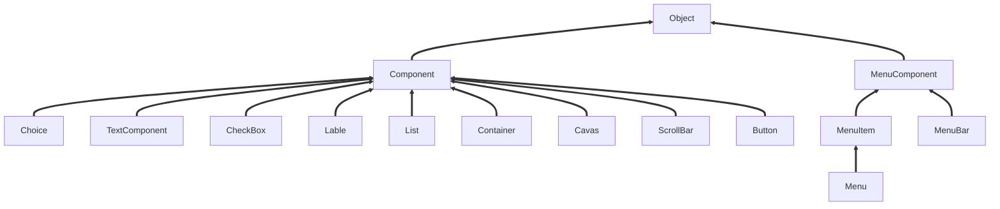
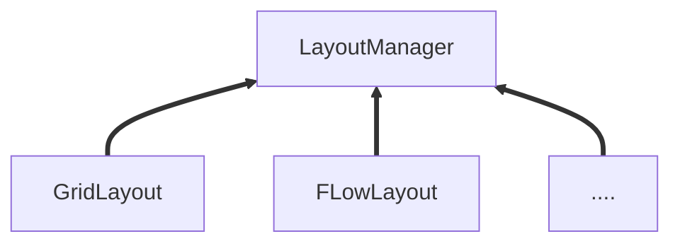
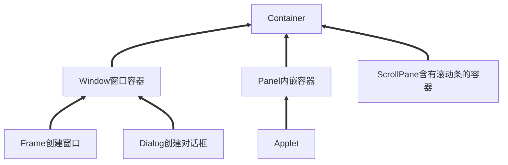
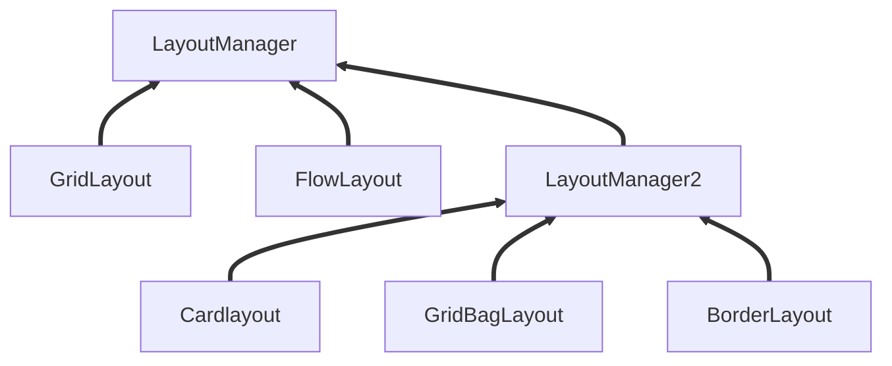
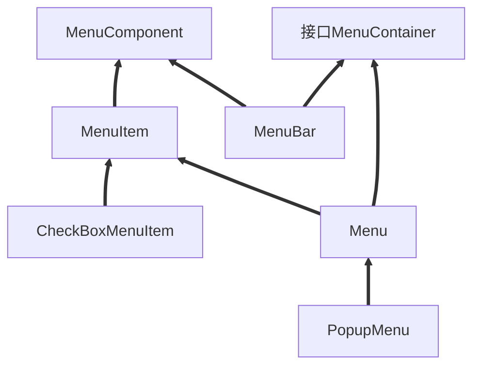

## 概述

java使用AWT和Swing相关的类可以完成图形化界面编程，其中AWT的全称是抽象窗口工具集(Abstract Window Toolkit),它是sun公司最早提供的GUI库，这个GUI库提供了一些基本功能，但这个GUI库的功能比较有限，所以后来sun公司又提供了Swing库。通过使用AWT和Swing提供的图形化界面组件库，java的图形化界面编程非常简单，程序只需要一次创建所需的图形组件，并以合适的方式将这些组件组织在一起，就可以开发出非常美观的用户界面。

## AWT编程

### AWT继承体系

所有和AWT编程相关的类都放在 **java.awt** 包以及它的子包中，AWT编程中有两个基类：Component 和MenuComponent

+ Component：代表一个能以图形化方式显示出来，并可与用户交互的对象，例如Button代表一个按钮TextField代表一个文本框等；
+ MenuComponent：则代表图形界面的菜单组件，包括 MenuBar(菜单条)、MenuItem(菜单项)等子类



其中Container是一种特殊的Component，它代表一种容器，可以盛装普通的 Component

AWT中还有一个非常重要的接口叫LayoutManager ，如果一个容器中有多个组件，那么容器就需要使用LayoutManager来管理这些组件的布局方式



### Container容器

**Container继承体系**



+ Window是可以独立存在的顶级窗口，默认使用BorderLayout管理其内部组件布局
+ Panel可以容纳其他组件，但不能独立存在，他必须内嵌其他容器中使用，默认使用FlowLayout管理其内部组件布局
+ ScrollPane是一个带滚动条的容器，它也不能独立存在，默认使用BorderLayout管理其内部组件布局

#### 常用API

**Component**

| 方法                                           | 说明                     |
| ---------------------------------------------- | ------------------------ |
| setLocation(int x,int y)                       | 设置组件的位置           |
| setSize(int width,int height)                  | 设置组件的大小           |
| setBounds(int x, int y, int width, int height) | 同时设置组件的位置、大小 |
| setVisible(Boolean b)                          | 设置该组件的可见性       |

**Container**

| 方法                                   | 说明                                     |
| -------------------------------------- | ---------------------------------------- |
| Component add(Component comp)          | 向容器中添加其他组件，并返回被添加的组件 |
| Component getComponentAt(int x, int y) | 返回指定点的组件                         |
| int getComponentCount()                | 返回该容器内组件的数量                   |
| Component[] getComponents()            | 返回该容器内的所有组件                   |

####   Window

```java
public static void main(String[] args) {
    //创建窗口对象
    Frame frame = new Frame("这里测试windouw窗口");

    //指定窗口位置大小
    frame.setLocation(100,100);
    frame.setSize(500,300);
    //设置窗口可见
    frame.setVisible(true);

}
```

#### Panel

```java
public static void main(String[] args) {
    System.out.println("java图形化编程");
    //创建Frame容器对象
    Frame frame = new Frame("这里再测试Panel");
    //创建Panel容器对象
    Panel panel = new Panel();
    //往Panel容器中添加组件
    panel.add(new TextField("这是一个测试文本"));
    panel.add(new Button("这是一个测试按钮"));
    //把panel放入window中
    frame.add(panel);
    //设置window的位置以及大小
    frame.setBounds(100,100,500,300);
    //设置window可见
    frame.setVisible(true);
}
```

#### ScrollPane

```java
public static void main(String[] args) {
    //创建Frame窗口对象
    Frame frame = new Frame();
    frame.setBounds(500,300,500,300);
    frame.setVisible(true);
    //创建ScrollPane对象，并且指定默认有滚动条
    ScrollPane sp = new ScrollPane(ScrollPane.SCROLLBARS_ALWAYS);
    //往ScrollPane中添加组件
    sp.add(new TextField("这是测试文本"));
    sp.add(new Label("这是测试Label"));
    //把ScrollPane添加到Frame中
    frame.add(sp);
}
```

### LayoutManager布局管理器

之前，在Component中有一个方法setBounds()可以设置当前容器的位置和大小，但是我们需要明确一件事，如果我们手动的为组件设置位置和大小的话，就会造成程序的不通用性，例如

``` java
Label label = new Label("你好，世界");
```

创建了一个label组件，很多情况下，需要让label组件的宽高和"你好，世界"这个字符串自身的高度一致，这种大小称为**最佳大小**。由于操作系统存在差异，例如在windows上，要达到这样的效果，需要把该Label组件的宽和高分别设置为100px,20px 但是在Linux操作系统上，可能需要把Label组件的宽和高分别设置为120px,24px 才能达到同样的效果。

Java提供了LayoutManager布局管理其，可以根据运行平台来自动调整组件大小，不用再手动设置组件大小和位置，只需要为容器选择合适的布局管理器即可



#### FlowLayout

在FlowLayout布局管理器中，组件像水流一样向某方向流动(排列)，遇到障碍(边界)就折回，重头开始排列。在默认情况下，FlowLayout布局管理器从左向右排列所有组件，遇到边界就会折回下一行重新开始。

| 构造方法                                  | 方法功能                                                     |
| ----------------------------------------- | ------------------------------------------------------------ |
| FlowLayout()                              | 使用默认 的对其方式及默认的垂直间距、水平间距创建FlowLayout布局管理器 |
| FlowLayout(int align)                     | 使用指定的对齐方式及默认的垂直间距、水平间距创建FlowLayout布局管理器 |
| FlowLayout(int align, int hgap, int vgap) | 使用指定的对齐方式及指定的垂直间距、水平间距创建             |

FlowLayout中组件的排列方向(从左向右、从右向左、从中间向两边等)，该参数应该使用FlowLayout类的静态常量：FlowLayout.LEFT、FlowLayout.CENTER、FlowLayout.RIGHT，默认是左对齐

FlowLayout中组件中间距离通过整数设置，单位是像素，默认是5个像素

```java
public static void main(String[] args) {
    Frame frame = new Frame("FlowLayout测试");
    frame.setVisible(true);

    //通过setLayout方法设置布局管理器
    frame.setLayout(new FlowLayout(FlowLayout.CENTER,20,20));
    //添加多个按钮到frame中
    for (int i = 0; i < 100; i++) {
        frame.add(new Button("按钮"+i));
    }

    //设置最佳大小，pack方法
    frame.pack();
}
```

#### BorderLayout

Borderlayout将容器分为EAST、SOUTH、WEST、NORTH、CENTER五个区域，普通组件可以被放置在这五个区域的任意一个中。


当改变使用BorderLayout的容器大小时，NORTH、SOUTH和CEBTER区域水平调整，而EAST、WEST和CENTER区域垂直调整。使用BorderLayout有如下两个注意点：

1. 当向使用BorderLayout布局管理器的容器中添加组件时，需要指定要添加到哪个区域中。如果没有指定添加到哪个区域中，则默认添加到中间区域中；
2. 如果向同一个区域中添加多个组件时，后放入的组件会覆盖先放入的组件

| 构造方法                        | 方法说明                                               |
| ------------------------------- | ------------------------------------------------------ |
| BorderLayout()                  | 使用默认的水平间距、垂直间距创建BorderLayout布局管理器 |
| BorderLayout(int hgap,int vgap) | 使用指定的水平间距、垂直间距创建BorderLayout布局管理器 |

```java
public static void main(String[] args) {
    Frame frame = new Frame("BorderLayout测试");
    frame.setVisible(true);
    //给frame设置BorderLayout布局管理器
    frame.setLayout(new BorderLayout(30,10));
    //往frame指定区域添加组件
    frame.add(new Button("北侧按钮"),BorderLayout.NORTH);
    frame.add(new Button("南侧按钮"),BorderLayout.SOUTH);
    frame.add(new Button("东侧按钮"),BorderLayout.EAST);
    frame.add(new Button("西侧按钮"),BorderLayout.WEST);
    frame.add(new Button("中间按钮"),BorderLayout.CENTER);
    frame.pack();
}
```

#### GridLayout

GridLayout布局管理器将容器分割成纵横线分割的网格，每个网格所占的区域大小相同。当向使用GridLayout布局管理器的容器中添加组件时，默认从左向右、从上向下依次添加到每个网格中。与FlowLayout不同的是，放置在GridLayout布局管理器中的个组件的大小由组件所处的区域决定(每个组件将自动占满整个区域)

| 构造方法                                           | 方法功能                                                     |
| -------------------------------------------------- | ------------------------------------------------------------ |
| GridLayout(int rows, int cols)                     | 采用指定的行数、列数、以及默认的横向纵向间距将容器分割成多个网格 |
| GridLayout(int rows, int cols, int hgap, int vgap) | 采用指定的行数、列数，以及指定的横向纵向间距将容器分割成多个网格 |

```java
public static void main(String[] args) {
    Frame frame = new Frame("计算器");
    //创建一个Panel，里面存放一个TextFiled组件
    Panel p = new Panel();
    p.add(new TextField(30));
    //Panel添加到frame北边区域
    frame.add(p,BorderLayout.NORTH);
    //创建一个Panle，设置布局管理器为GridLayout
    Panel p2 = new Panel();
    p2.setLayout(new GridLayout(3,5,4,4));
    //往Panle中添加内容
    for (int i = 0; i < 10; i++) {
        p2.add(new Button(i+""));
    }
    p2.add(new Button("+"));
    p2.add(new Button("-"));
    p2.add(new Button("*"));
    p2.add(new Button("/"));
    p2.add(new Button("%"));

    //把当前Panle添加到frame中
    frame.add(p2);
    
    frame.pack();
    frame.setVisible(true);
}
```

#### GridBagLayout

GridBagLayout布局管理器的功能最强大，但也最复杂，与GridLayout布局管理器不同的是，在GridBagLayout布局管理器中，一个组件可以跨越一个或多个网格，并可以设置各网络的大小互不相同，从而增加了布局的灵活性。当窗口的大小发生变化时，GridBagLayout布局管理器中也可以准确地控制窗口各部分地拉伸

由于在GridBagLayout布局中，每个组件可以占用多个网络，此时，我们往容器中添加组件的时候，就需要具体的控制每个组件占用多个网格，java提供的GridBagConstaints类，与特定的组件绑定，可以完成具体大小和跨越性的设置

**不推荐使用**

#### CardLayout

CardLayout布局管理器以时间而非空间来管理它里面的组件，它将加入容器的所有组件看成一叠卡片(每个卡片其实就是一个组件)，每次只有最上面的那个Component才可见。就好像一副扑克牌，它们叠在一起，每次只有最上面的一张扑克牌才可见

| 方法名称                          | 说明                                                         |
| --------------------------------- | ------------------------------------------------------------ |
| CardLayout()                      | 创建默认的CardLayout布局管理器                               |
| CardLayout(int hgap, int vgap)    | 通过指定卡片与容器 左右边界的间距(hgap)、上下边界(vgap)的间距来创建CardLayout布局管理器 |
| first(Container target)           | 显示target容器中的第一张卡片                                 |
| last(Container target)            | 显示target容器中的最后一张卡片                               |
| previous(Container target)        | 显示target容器中的前一张卡片                                 |
| next(Container target)            | 显示target容器中的后一张卡片                                 |
| show(Container taget,String name) | 显示target容器中指定名字的卡片                               |

```java
public static void main(String[] args) {
    Frame frame = new Frame("CardLayout测试");
    //创建一个P1用来存储多张卡片
    Panel p1 = new Panel();
    //创建CardLayout对象并 设置给Panel
    CardLayout c = new CardLayout();
    p1.setLayout(c);
    //往p1中存储多个卡片
    String[] names = {"第一张", "第二张", "第三张", "第四张", "第五张"};
    Arrays.stream(names).forEach(name -> p1.add(name,new Button(name)));
    //Panel放入frame中间区域
    frame.add(p1);
    //创建第二个p2用来存储多个按钮组件
    Panel p2 = new Panel();
    //创建5个按钮组件
    Button b1 = new Button("上一张");
    Button b2 = new Button("下一张");
    Button b3 = new Button("第一张");
    Button b4 = new Button("最后一张");
    Button b5 = new Button("第三张");
    //创建一个事件监听器，监听按钮点击动作
    ActionListener listener = new ActionListener() {
        @Override
        public void actionPerformed(ActionEvent e) {
            String actionCommand = e.getActionCommand();
            switch (actionCommand){
                case "上一张张":
                    c.previous(p1);
                    break;
                case "下一张":
                    c.next(p1);
                    break;
                case "第一张":
                    c.first(p1);
                    break;
                case "最后一张":
                    c.last(p1);
                    break;
                case "第三张":
                    c.show(p1,"第三张");
                    break;
            }
        }
    };
    //把当前事件监听器和多个按钮绑定到一起
    b1.addActionListener(listener);
    b2.addActionListener(listener);
    b3.addActionListener(listener);
    b4.addActionListener(listener);
    b5.addActionListener(listener);
    //把按钮添加到容器p2中
    p2.add(b1);
    p2.add(b2);
    p2.add(b3);
    p2.add(b4);
    p2.add(b5);
    //把p2放入frame南区
    frame.add(p2,BorderLayout.SOUTH);

    frame.pack();
    frame.setVisible(true);
}
```

#### BoxLayout

为了简化开发，Swing引入了一个新的布局管理器：BoxLayout。BoxLayout可以在垂直和水平两个方向上摆放GUI组件，BoxLayout提供了如下一个简单的构造器

| 方法                                  | 说明                                                         |
| ------------------------------------- | ------------------------------------------------------------ |
| BoxLayout(Container target, int axis) | 指定创建基于 target容器的BoxLayout布局管理器，该布局管理器里的组件按axis方向排列 |

axis：BoxLayout.X_AXIS(横向)、BoxLayout.Y_AXIS(纵向)

```java
public static void main(String[] args) {
    Frame frame = new Frame();

    //基于frame,创建BoxLayout对象，并且该对象组件垂直存放
    BoxLayout boxLayout = new BoxLayout(frame,BoxLayout.Y_AXIS);
    //把BoxLayout对象设置给frame
    frame.setLayout(boxLayout);
    //往frame中添加两个按钮组件
    frame.add(new Button("按钮1"));
    frame.add(new Button("按钮2"));

    frame.pack();
    frame.setVisible(true);
}
```

在java.swing包中，提供了一个新的容器Box，该容器的默认布局管理器就是BoxLayout，大多数情况下，使用Box容器去容纳多个GUI组件，然后再把Box容器作为一个组件，添加到其他的容器中，从而形成整体窗口布局

| 方法                             | 说明                          |
| -------------------------------- | ----------------------------- |
| static Box createHorizontalBox() | 创建一个水平排列组建的Box容器 |
| static Box createVerticalBox()   | 创建一个垂直排列组件的Box容器 |

Box类中，提供了5个静态方法来生成组件间隔

| 方法                                              | 说明                                                         |
| ------------------------------------------------- | ------------------------------------------------------------ |
| static Component createHorizontalGlue()           | 创建一条水平Glue(可在两个方向上同时拉伸的间距)               |
| static Component createVerticalGlue()             | 创建一条垂直Glue(可在两个方向上同时拉伸的间距)               |
| static Component createHorizontalStrut(int width) | 创建一条指定宽度(宽度固定了，不能拉伸)的水平Strut(可在垂直方向上拉伸的间距) |
| static Component createVerticalStrut(int height)  | 创建一条指定高度(高度固定了，不能拉伸)的垂直Strut(可在水平方向上拉伸的间距) |

```java
public static void main(String[] args) {
    Frame frame = new Frame();
    //创建水平排列的hBox容器
    Box hBox = Box.createHorizontalBox();
    //往hBox容器中添加按钮，还需要做多个按钮间添加分割
    hBox.add(new Button("水平按钮1"));
    hBox.add(Box.createHorizontalGlue());//该分割在两个方向生上可以拉伸
    hBox.add(new Button("水平按钮2"));
    hBox.add(Box.createHorizontalStrut(30));
    hBox.add(new Button("水平按钮3"));
    //创建垂直排列的vBox容器
    Box vBox = Box.createVerticalBox();
    //往vBox容器中添加按钮，还需要做多个按钮间添加分割
    vBox.add(new Button("垂直按钮1"));
    vBox.add(Box.createVerticalGlue());//该分割在两个方向上都可以拉伸
    vBox.add(new Button("垂直按钮2"));
    vBox.add(Box.createVerticalStrut(30));
    vBox.add(new Button("垂直按钮3"));

    //把box容器添加到frame中
    frame.add(hBox,BorderLayout.NORTH);
    frame.add(vBox);

    frame.pack();
    frame.setVisible(true);
}
```

### AWT中常用组件

#### 基本组件

| 组件名        | 功能                                                         |
| ------------- | ------------------------------------------------------------ |
| Button        | 按钮                                                         |
| Canvas        | 用于绘画的画布                                               |
| Checkbox      | 复选框组件(也可当做单选框组件使用)                           |
| CheckboxGroup | 用于将多个Checkbox组件组合成一组，一组Checkbox组件将只有一个可以被选中，即全部变成单选框组件 |
| Choice        | 下拉选择框                                                   |
| Frame         | 窗口，在GUI程序里通过该类创建窗口                            |
| Label         | 标签类，用于放置提示性文本                                   |
| List          | 列表框组件，可以添加多项条目                                 |
| Panel         | 不能单独存在基本容器类，必须放到其他容器中                   |
| Scrollbar     | 滑动条组件。如果需要用户输入位于某个范围的值，就可以使用滑动条组件，比如调色板中设置RGB的三个值所用的滑动条。当创建一个滑动条时，必须指定它的方向、初始值、滑块的大小、最小值和最大值 |
| ScrollPane    | 带水平及垂直滑动条的容器组件                                 |
| TextArea      | 多行文本域                                                   |
| TextField     | 单行文本框                                                   |

```java
public class BasicComponentDemo {
    Frame frame = new Frame("基本组件测试");

    TextArea ta = new TextArea(5,20);

    Choice colorChooser = new Choice();

    CheckboxGroup cbg = new CheckboxGroup();
    Checkbox male = new Checkbox("男",cbg,true);
    Checkbox famale = new Checkbox("女",cbg,false);

    Checkbox isMarried = new Checkbox("是否已婚");

    TextField tf = new TextField(20);
    Button ok = new Button("确认");

    List colorList = new List(6,true);
    //组装界面
    public void init(){
        //组装底部
        Box bBox = Box.createHorizontalBox();
        bBox.add(tf);
        bBox.add(ok);

        frame.add(bBox,BorderLayout.SOUTH);

        //组装选择部分
        colorChooser.add("红色");
        colorChooser.add("蓝色");
        colorChooser.add("绿色");
        Box cBox = Box.createHorizontalBox();
        cBox.add(colorChooser);
        cBox.add(male);
        cBox.add(famale);
        cBox.add(isMarried);
        
        //组装文本域和选择部分
        Box topleft = Box.createVerticalBox();

        topleft.add(ta);
        topleft.add(cBox);

        //组装顶部左边和列表框
        colorList.add("红色");
        colorList.add("绿色");
        colorList.add("蓝色");
        Box top = Box.createHorizontalBox();
        top.add(topleft);
        top.add(colorList);

        frame.add(top);
        frame.pack();
        frame.setVisible(true);

    }

    public static void main(String[] args) {
        new BasicComponentDemo().init();
    }
    
}
```

#### 对话框Dialog

##### Dialog

Dialog是window类的子类，是一个容器类，属于特殊组件。对话框是可以独立存在的顶级窗口，因此用法与普通窗口的用法几乎完全一样，但是使用对话框需要注意下面两点：

+ 对话框通常依赖于其他窗口，就是通常需要有一个父窗口；
+ 对话框有非模式(non-modal)和模式(modal)两种，当某个模式对话框被打开后，该模式对话框总是位于它的父窗口之上，在模式对话框关闭之前，父窗口无法获得焦点

| 方法                                             | 功能                                                         |
| ------------------------------------------------ | ------------------------------------------------------------ |
| Dialog(Frame owner, String title, boolena modal) | 创建一个对话框对象<br />owner：当前对话框的父窗口<br />title：当前对话框的标题<br />modal：当前对话框是否是模式对话框，true/false |

```java
public static void main(String[] args) {
    Frame frame = new Frame("Dialog测试");
    //创建两个对话框Dialog对象，一个模式的，一个非模式的
    Dialog d1 = new Dialog(frame, "模式", true);
    Dialog d2 = new Dialog(frame, "非模式", false);

    //创建一个垂直的Box容器，把一个文本框和一个按钮添加到容器中
    Box vbox = Box.createVerticalBox();
    vbox.add(new TextField(20));
    vbox.add(new Button("确认"));
    //把容器添加到d1中
    d1.add(vbox);

    //通过setBounds方法设置Dialog的位置以及大小
    d1.setBounds(20,30,300,200);
    d2.setBounds(20,30,300,200);
    //创建两个按钮
    Button b1 = new Button("打开模式对话框");
    Button b2 = new Button("打开非模式对话框");
    //给这两个按钮添加点击后的行为
    b1.addActionListener(e -> d1.setVisible(true));
    b2.addActionListener(e -> d2.setVisible(true));

    //把按钮添加到frame中
    frame.add(b1,BorderLayout.NORTH);
    frame.add(b2);

    frame.pack();
    frame.setVisible(true);
}
```

##### FileDialog

Dialog类还有一个子类：FileDialog，它代表一个文件对话框，用于打开或者保存文件，需要注意的是FileDialog无法指定模式或者非模式，这是因为FileDialog依赖于运行平台的实现，如果运行平台的文件对话框时模式的，那么FileDialog也是模式的，否则就是非模式的

| 方法                                             | 功能                                                         |
| ------------------------------------------------ | ------------------------------------------------------------ |
| FileDialog(Frame parent, String title, int mode) | 创建一个文件对话框<br />parent：指定父窗口<br />title：对话框标题<br />mode：文件对话框类型，如果指定为FileDialog.LOAD，用于打开文件，如果指定为FileDialog.SAVE，用于保存文件 |
| String getDirectory()                            | 获取被打开或保存文件的绝对路径                               |
| String getFile()                                 | 获取被打开或保存文件的文件名                                 |

```java
public static void main(String[] args) {
    Frame frame = new Frame();

    //创建两个文件对话框
    FileDialog saveFile = new FileDialog(frame, "保存文件", FileDialog.SAVE);
    FileDialog loadFile = new FileDialog(frame, "打开文件", FileDialog.LOAD);

    //创建两个按钮
    Button b1 = new Button("保存文件");
    Button b2 = new Button(("打开文件"));
    b1.addActionListener(e -> {
        saveFile.setVisible(true);
        String directory = saveFile.getDirectory();
        String file = saveFile.getFile();
        System.out.println("保存的文件路径为: "+directory);
        System.out.println("文件名为："+ file);
    });
    b2.addActionListener(e -> {
        loadFile.setVisible(true);
        String directory = loadFile.getDirectory();
        String file = loadFile.getFile();
        System.out.println("打开的文件路径为"+directory);
        System.out.println("文件名为："+file);
    });
    //把按钮添加到frame中
    Box box = Box.createVerticalBox();
    box.add(b1);
    box.add(b2);

    frame.add(box);
    frame.pack();
    frame.setVisible(true);
}
```

### 事件处理

#### GUI事件处理机制

定义：当在某个组件上发生某些操作的时候，会自动的触发一段代码的执行。

在GUI事件处理机制中涉及到4个重要的概念需要理解：

**事件源(Event Source)**：操作发生的场所，通常指某个组件，例如按钮、窗口等；

**事件(Event)**：在事件源上发生的操作可以叫做事件，GUI会把事件都封装到一个Event对象中，如果需要知道该事件的详细信息，就可以通过Event对象来获取

**事件监听器(Event Listener)**：当在某个事件源上发生了某个事件，事件监听器就可以对这个事件进行处理

**注册监听**：把某个事件监听器(A)通过某个事件(B)绑定到某个事件源(C)上，当在事件源C上发生了事件B之后，那么事件监听器A的代码就会自动执行。

**使用步骤**：

1. 创建事件源组件对象
2. 自定义类，实现XxxListener接口，重写方法；
3. 创建事件监听器对象(自定义类对象)
4. 调用事件源组件对象的addXxxListener方法完成注册监听

```java
public class EventDemo01 {
    Frame frame= new Frame("事件处理测试");
    TextField tf= new TextField(30);
    //事件源
    Button button = new Button("确认");

    public void init(){
        //组装视图
        //注册监听
        button.addActionListener(e -> tf.setText("Hello World"));

        //把tf 、button放入到fream中
        Box box = Box.createVerticalBox();
        box.add(tf);
        box.add(button);
        frame.add(box);

        frame.pack();
        frame.setVisible(true);
    }

    public static void main(String[] args) {
        new EventDemo01().init();
    }
```

#### GUI中常见事件和事件监听器

事件监听器必须实现事件监听器接口，AWT提供了大量的事件监听器接口用于实现不同类型的事件监听器，用于监听不同类型的事件。AWT中提供了丰富的事件类，用于封装不同组件上所发生的特定操作，AWT的事件类都是AWTEvent类的子类，AwTEvent是EventObject的子类

##### 事件

AWT把事件分为了两个大类

1. 低级事件：这类事件是基于某个特定动作的事件。比如进入、点击、拖动等动作的鼠标事件，再比如得到焦点和失去焦点等焦点事件

| 事件           | 触发时机                                                     |
| -------------- | ------------------------------------------------------------ |
| ComponentEvent | 组件事件，当组件尺寸发生改变、位置发生移动、显示/隐藏状态发生改变时触发该事件 |
| ContainerEvent | 容器时间，当容器里发生添加组件、删除组件时触发该事件         |
| WindowEvent    | 窗口时间，当窗口状态发生改变(如打开、关闭、最大化、最小化)时触发该事件 |
| FocusEvent     | 焦点事件，当组件得到焦点或失去焦点时触发该事件               |
| KeyEvent       | 键盘事件，当按键被按下、松开、单击时触发该事件               |
| MouseEvent     | 鼠标事件，当进行单击、按下、松开、移动鼠标等动作时触发该事件 |
| PaintEvent     | 组件绘制事件，该事件是一个特殊的事件类型，当GUI组件调用update/paint方法来呈现自身时触发该事件，该事件并发专用于事件处理模型 |

2. 高级事件：这类事件并不会基于某个特定动作，而是根据功能含义定义的事件

| 事件           | 触发时机                                                     |
| -------------- | ------------------------------------------------------------ |
| ActionEvent    | 动作事件，当按钮、菜单项被单击，在TextField中按Enter键时触发 |
| AjustmentEvent | 调节事件，在滚动条上移动滑块以调节数值时触发该事件           |
| ItemEvent      | 选项事件，当用户选中某项，或取消选中某项时触发该事件         |
| TextEvent      | 文本时间，文本框、文本域里的文本发生改变时触发该事件         |

##### 事件监听器

不同的事件需要使用不同的监听器监听，不同的监听器需要实现不统的监听器接口，当指定事件发生后，事件监听器就会调用所包含的事件处理器(实例方法)来处理事件

| 事件类型        | 描述信息                 | 监听器接口          |
| --------------- | ------------------------ | ------------------- |
| ActionEvent     | 激活组件                 | ActionListener      |
| ItemEvent       | 选择了某些项目           | ItemListener        |
| MouseEvent      | 鼠标移动                 | MouseMotionListener |
| MouseEvent      | 鼠标点击等               | MouseListener       |
| KeyEvent        | 键盘输入                 | KeyListener         |
| FocusEvent      | 组件收到或失去焦点       | FocusListener       |
| AdjustmentEvent | 移动了滚动条等组件       | AdjustmentListener  |
| CompoentEvent   | 对象移动缩放显示隐藏等   | ComponentListener   |
| WindowEvent     | 窗口收到窗口级事件       | WindowListener      |
| ContainerEvent  | 容器中添加删除了组件     | ContainerListener   |
| TextEvent       | 文本字段或文本区发生改变 | TextListener        |

```java
public class ListenerDemo01 {
    Frame frame = new Frame("监听器测试");
    
    //创建组件（事件源
    TextField textField = new TextField(30);
    Choice names = new Choice();
    Label label = new Label();
    
    public void init(){
        frame.setBounds(300,200,500,400);
        label.setSize(500,300);
        label.setBackground(new Color(200,200,200));
        names.add("张三");
        names.add("李四");
        names.add("王五");

        //给文本域添加TextListener，监听内容的变化
        textField.addTextListener(e -> label.setText(textField.getText()));
        //给下拉选择框添加ItemListener，监听条目选择的变化
        names.addItemListener(e -> label.setText(names.getSelectedItem()));
        //给frame注册ContainerListener监听器，监听容器中组件的添加
        frame.addContainerListener(new ContainerAdapter() {
            @Override
            public void componentAdded(ContainerEvent e) {
                Component child = e.getChild();
                label.setText("frame中添加了："+child);
            }

            @Override
            public void componentRemoved(ContainerEvent e) {
            }
        });
        //设置WindowListener，监听用户点机X的动作，如果用户点机X，则关闭窗口
        frame.addWindowListener(new WindowAdapter() {
            @Override
            public void windowClosing(WindowEvent e) {
                System.exit(0);
            }
        });

        //添加到frame中
        Box hbox = Box.createHorizontalBox();
        hbox.add(names);
        hbox.add(textField);
        Box vbox = Box.createVerticalBox();
        vbox.add(hbox);
        vbox.add(label);
        frame.add(vbox);

        frame.pack();
        frame.setVisible(true);
    }

    public static void main(String[] args) {
        new ListenerDemo01().init();
    }
}
```

### 菜单组件

常见的菜单相关组件

| 菜单组件名称     | 功能                                                         |
| ---------------- | ------------------------------------------------------------ |
| MenuBar          | 菜单条，菜单的容器                                           |
| Menu             | 菜单组件，菜单项的容器。它也是MenuItem的子类，所以可作为菜单项使用 |
| PopupMenu        | 上下文菜单组件(右键菜单组件)                                 |
| MenuItem         | 菜单项组件                                                   |
| CheckboxMenuItem | 复选框菜单项组件                                             |

常见的菜单组件继承体系图



小技巧：

1. 如果要在某个菜单的菜单项之间添加分割线，那么只需要调用Menu的add(new MenuItem("-"))即可
2. 如果要给某个菜单项关联快捷功能，那么只需要在创建菜单项对象时设置即可，例如给菜单项关联ctrl+shift+Q 快捷键，著需要：new MenuItem("菜单项名字", new MenuShortcut(KeyEvent.VK_Q,true));

```java
import javax.swing.*;
import java.awt.*;
import java.awt.event.*;


public class SimpleMenu {
    private Frame frame = new Frame("这里测试菜单相关组件");
    MenuBar menuBar = new MenuBar();
    //创建菜单组件
    Menu fileMenu = new Menu("文件");
    Menu editMenu = new Menu("编辑");
    Menu formatMenu = new Menu("格式");

    //菜单项组件
    MenuItem auto =new MenuItem("自动换行");
    MenuItem copy = new MenuItem("复制");
    MenuItem paste = new MenuItem("粘贴");

    MenuItem comment = new MenuItem("注释",new MenuShortcut(KeyEvent.VK_Q,true));
    MenuItem cancelConmment = new MenuItem("取消注释");

    MenuItem save = new MenuItem("保存");

    Label label = new Label();
    Panel panel = new Panel();
    Box box = Box.createVerticalBox();

    PopupMenu popupMenu = new PopupMenu();

    public void init(){
        label.setSize(500,300);
        label.setBackground(new Color(200,200,200));
        panel.setSize(500,300);
        panel.setBackground(new Color(190,190,190));
        box.add(label);
        box.add(panel);
        frame.add(box);
        comment.addActionListener(e -> label.setText("注释菜单执行"));
        cancelConmment.addActionListener(e -> label.setText(""));
        frame.addWindowListener(new WindowAdapter() {
            @Override
            public void windowClosing(WindowEvent e) {
                System.exit(0);
            }
        });
        //组装视图
        menuBar.add(fileMenu);
        menuBar.add(editMenu);
        editMenu.add(auto);
        editMenu.add(copy);
        editMenu.add(paste);
        editMenu.add(formatMenu);
        formatMenu.add(comment);
        formatMenu.add(cancelConmment);

        popupMenu.add(comment);
        popupMenu.add(cancelConmment);
        popupMenu.add(copy);
        popupMenu.add(save);

        panel.add(popupMenu);
        panel.addMouseListener(new MouseAdapter() {
            @Override
            public void mouseReleased(MouseEvent e) {
                boolean popupTrigger = e.isPopupTrigger();
                if (popupTrigger){
                    //显示popupMenu
                    popupMenu.show(panel,e.getX(),e.getY());
                }
            }
        });

        frame.setMenuBar(menuBar);


        //设置frame最佳大小并可见
        frame.setSize(500,300);
        frame.setVisible(true);
    }

    public static void main(String[] args) {
        new SimpleMenu().init();
    }
}
```

### 绘图

很多程序如各种游戏都需要在窗口中绘制各种图形，除此之外，即使在开发javaEE项目时，有时候也必须"动态"地向客户端生成各种图形、图表，比如 图形验证码、统计图等，这都需要利用AWT的绘图功能

#### 组件绘图原理

例如Button、Frame、Checkbox等等，不同的组件，展现出来的图形都不一样，其实这些组件展现出来的图形，其本质就是用AWT的绘图来完成的

在AWT中，真正提供绘图功能的是Graphics对象，在Component类中，提供了三个方法来完成组件图形的绘制与刷新

paint(Graphics g)：绘制组件的外观；

update(Graphics g)：内部调用paint方法，刷新外观组件；

repaint()：调用update方法，刷新组件外观；


#### Graphics对象的使用

**画图步骤**

1. 自定义类，继承Canvas类，重写paint(Graphics g)方法完成画图
2. 在paint方法内部，真正开始画图之前调用Graphics对象setColor()、setFont()等方法设置画笔的颜色、字体等属性
3. 调用Graphics画笔的drawXxx()方法开始画图

Graphics

| 方法名称           | 方法功能                 |
| ------------------ | ------------------------ |
| setColor(Color c)  | 设置颜色                 |
| setFont(Font font) | 设置字体                 |
| drawLine()         | 绘制直线                 |
| drawRect()         | 绘制矩形                 |
| drawRoundRect()    | 绘制圆角矩形             |
| drawOval()         | 绘制椭圆形               |
| drawPolygon()      | 绘制多边形               |
| drawArc()          | 绘制圆弧                 |
| drawPolyline()     | 绘制折线                 |
| fillRect()         | 填充矩形区域             |
| fileRoundRect()    | 填充圆角矩形区域         |
| fillOval()         | 填充椭圆区域             |
| fillPolygon()      | 填充多边形区域           |
| fillArc()          | 填充圆弧所对应的扇形区域 |
| drawImage()        | 绘制位图                 |

```java
public class SimpleDraw {
    private final String RECT_SHAPE="rect";
    private final String OVAL_SHAPE="oval";

    private Frame frame = new Frame("绘图测试");

    Button btnRect = new Button("绘制矩形");
    Button btnOval = new Button("绘制椭圆");
    //定义一个变量，记录当前要绘制椭圆还是矩形
    private String shape="";

    //自定义类，继承Canvas类，重写paint(Graphics g)方法完成画图
    private class MyCanvas extends Canvas{
        @Override
        public void paint(Graphics g) {
            //绘制不同的图形
            if (shape.equals(RECT_SHAPE)){
                //绘制矩形
                g.setColor(Color.black);
                g.drawRect(100,100,150,100);
            } else if (shape.equals(OVAL_SHAPE)) {
                //绘制椭圆
                g.setColor(Color.RED);
                g.drawOval(50,50,100,100);
            }
        }
    }
    //创建自定义的画布对象
    MyCanvas drawArea = new MyCanvas();
    
    public void init(){
        //组装视图
        btnRect.addActionListener(new ActionListener() {
            @Override
            public void actionPerformed(ActionEvent e) {
                //修改标记的值为Rect
                shape = RECT_SHAPE;
                drawArea.repaint();
            }
        });

        btnOval.addActionListener(new ActionListener() {
            @Override
            public void actionPerformed(ActionEvent e) {
                shape = OVAL_SHAPE;
                drawArea.repaint();
            }
        });

        //创建Panel,承载按钮
        Panel p = new Panel();
        p.add(btnRect);
        p.add(btnOval);
        frame.add(p,BorderLayout.SOUTH);
        drawArea.setPreferredSize(new Dimension(500,300));
        frame.add(drawArea);

        frame.addWindowListener(new WindowAdapter() {
            @Override
            public void windowClosing(WindowEvent e) {
                System.exit(0);
            }
        });

        frame.pack();
        frame.setVisible(true);
    }

    public static void main(String[] args) {
        new SimpleDraw().init();
    }
}
```

Java也可用于开发一些动画。所谓动画，就是间隔一定的时间(通常小于0.1秒)重新绘制新的图像，两次绘制的图像之间差异较小，肉眼看起来就成了所谓的动画

为了实现间隔一定的时间就重新调用组建的repaint()方法，可以借助于Swing提供的Timer类，Timer类是一个定时器，它有如下一个构造器：

Timer(int delay, ActionListener listener)：每间隔delay毫秒，系统自动触发ActionListener监听器里的事件处理器方法，在方法内部我们就可以调用组件的repaint方法，完成组件重绘

```java
public class PinBall {
    private Frame frame = new Frame("弹球游戏");

    //桌面宽度
    private final int TABLE_WIDTH = 300;
    //桌面高度
    private final int TABLE_HEIGHT = 400;

    //球拍的高度和宽度
    private final int RACKET_WIDTH = 60;
    private final int RACKET_HEIGHT = 20;

    //小球的大小
    private final int Ball_SIZE = 16;

    //定义变量记录小球坐标
    private int ballX = 120;
    private int ballY = 20;

    //定义变量，记录小球在x和y方向上分别移动的速度
    private int speedY = 10;
    private int speedX = 5;

    //定义变量，记录球拍坐标
    private int racketX = 120;
    private final int racketY = 340;

    //定义变量，标识当前游戏是否结束
    private boolean isOver = false;

    //声明一个定时器
    private Timer timer;

    //自定义一个类，继承canvas，充当画布
    private class MyCanvas extends Canvas {
        @Override
        public void paint(Graphics g) {
            //TODO 在这里绘制内容
            if (isOver) {
                //游戏结束
                g.setColor(Color.BLUE);
                g.setFont(new Font("Times", Font.BOLD, 30));
                g.drawString("游戏结束了", 50, 200);
            } else {
                //游戏中

                //绘制小球
                g.setColor(Color.RED);
                g.fillOval(ballX, ballY, Ball_SIZE, Ball_SIZE);
                //绘制球拍
                g.setColor(Color.PINK);
                g.fillRect(racketX, racketY, RACKET_WIDTH, RACKET_HEIGHT);
            }
        }
    }

    //创建绘画区域
    MyCanvas drawArea = new MyCanvas();

    public void init() {
        //视图组装,游戏逻辑的控制

        //完成球拍坐标的变化
        KeyListener listener = new KeyAdapter() {
            @Override
            public void keyPressed(KeyEvent e) {
                //获取当前按向的键
                int keyCode = e.getKeyCode();
                if (keyCode == KeyEvent.VK_LEFT) {
                    //<- 应该向左移动
                    if (racketX > 0) {
                        racketX -= 10;
                    }
                }
                if (keyCode == KeyEvent.VK_RIGHT) {
                    //-> 应该向右移动
                    if (racketX < TABLE_WIDTH - RACKET_WIDTH) {
                        racketX += 10;
                    }
                }
            }
        };
        //给frame和drawArea设置监听器
        frame.addKeyListener(listener);
        drawArea.addKeyListener(listener);

        //小球坐标的控制
        ActionListener task = new ActionListener() {
            @Override
            public void actionPerformed(ActionEvent e) {
                //根据边界范围，修正速度
                if (ballX <= 0 || ballX >= (TABLE_WIDTH - Ball_SIZE)) {
                    speedX = -speedX;
                }
                if (ballY <=0 || (ballY >=(racketY-Ball_SIZE) && ballX>racketX &&ballX<racketX+RACKET_WIDTH)){
                    speedY = -speedY;
                }
                if (ballY >racketY-Ball_SIZE && (ballX<racketX ||ballX>racketX+RACKET_WIDTH)){
                    //当前小球超过球拍范围游戏结束
                    //停止定时器
                    timer.stop();
                    //修改游戏是否结束标记
                    isOver = true;
                    //重绘界面
                    drawArea.repaint();
                }
                //更新小球的坐标重绘界面
                ballX += speedX;
                ballY += speedY;

                //重绘界面
                drawArea.repaint();
            }
        };
        timer = new Timer(100, task);
        timer.start();

        drawArea.setPreferredSize(new Dimension(TABLE_WIDTH,TABLE_HEIGHT));

        frame.add(drawArea);

        frame.addWindowListener(new WindowAdapter() {
            @Override
            public void windowClosing(WindowEvent e) {
                System.exit(0);
            }
        });
        frame.pack();
        frame.setVisible(true);
    }

    public static void main(String[] args) {
        new PinBall().init();
    }
}
```

#### 处理位图

Graphics 提供了drawImage(image image)方法用于绘制位图，该方法需要一个Image参数——代表位图，通过该方法就可以绘制出指定的位图

**位图使用步骤**

1. 创建Image的子类对象BufferedImage(int width, int height, int ImageType),创建时需要指定位图的宽高及类型属性；此时相当于在内存中生成了一张图片
2. 调用BufferedImage对象的getGraphics()方法获得画笔，此时就可以往内存中的这张图片上绘图了，绘图的方法和之前学习的一摸一样；
3. 调用组件paint方法中提供的Graphics对象的drawImage()方法，一次性的内存中图片BufferedImage绘制到特定的组件上

```java
public class HandDraw {
    private Frame frame = new Frame("简单手绘程序");
    //定义画图区的宽高
    private final int AREA_WIDTH = 500;
    private final int AREA_HEIGHT = 400;

    //定义一个右键，用于设置画笔的颜色
    private PopupMenu colorMenu = new PopupMenu();
    private MenuItem red = new MenuItem("红色");
    private MenuItem green = new MenuItem("绿色");
    private MenuItem blue = new MenuItem("蓝色");

    //定义一个变量，存储默认颜色
    private Color forcecolor = Color.BLACK;

    //定义一个BufferedImage对象
    BufferedImage bi = new BufferedImage(AREA_WIDTH, AREA_HEIGHT, BufferedImage.TYPE_INT_RGB);
    //通过位图获取Graphics对象
    Graphics g = bi.getGraphics();

    //自定义一个类继承，canves
    private class MyCanves extends Canvas {
        @Override
        public void paint(Graphics g) {
            g.drawImage(bi, 0, 0, null);

        }
    }

    MyCanves drawArea = new MyCanves();

    //定义变量，存储鼠标拖动过程中，上一次所处的坐标
    private int preX = -1;
    private int preY = -1;

    private void init() {
        //组装视图
        ActionListener listener = new ActionListener() {
            @Override
            public void actionPerformed(ActionEvent e) {
                String actionCommand = e.getActionCommand();
                switch (actionCommand) {
                    case "红色":
                        forcecolor = Color.red;
                        break;
                    case "蓝色":
                        forcecolor = Color.BLUE;
                        break;
                    case "绿色":
                        forcecolor = Color.GREEN;
                        break;
                }
            }
        };
        red.addActionListener(listener);
        blue.addActionListener(listener);
        green.addActionListener(listener);

        colorMenu.add(red);
        colorMenu.add(blue);
        colorMenu.add(green);

        //把colorMenu设置给drawArea
        drawArea.add(colorMenu);

        drawArea.addMouseListener(new MouseAdapter() {
            @Override
            public void mouseReleased(MouseEvent e) {//当鼠标抬起时响应
                boolean popupTrigger = e.isPopupTrigger();//判断是不是右键抬起
                if (popupTrigger) {
                    colorMenu.show(drawArea, e.getX(), e.getY());
                }

                preX =-1;
                preY =-1;
            }
        });

        //设置位图的背景为白色
        g.setColor(Color.white);
        g.fillRect(0, 0, AREA_WIDTH, AREA_HEIGHT);

        //通过监听鼠标的移动完成线条绘制
        drawArea.addMouseMotionListener(new MouseMotionAdapter() {
            //该方法当鼠标作键按下并进行拖动时会被调用
            @Override
            public void mouseDragged(MouseEvent e) {
                if (preX > 0 && preY > 0) {
                    g.setColor(forcecolor);
                    //画线条  需要两组坐标分别代表线条的起点和终点 e.getX()  e.getY()  可以获取具体坐标
                    g.drawLine(preX, preY, e.getX(), e.getY());
                }
                //修正preX preY
                preX = e.getX();
                preY = e.getY();

                //重绘组件
                drawArea.repaint();

            }
        });

        drawArea.setPreferredSize(new Dimension(AREA_WIDTH,AREA_HEIGHT));
        frame.add(drawArea);


        //设置关闭按钮，设置最佳大小并可见
        frame.addWindowListener(new WindowAdapter() {
            @Override
            public void windowClosing(WindowEvent e) {
                System.exit(0);
            }
        });
        frame.pack();
        frame.setVisible(true);
    }

    public static void main(String[] args) {
        new HandDraw().init();
    }
}
```

#### ImageIO的使用

在实际生活中，很多软件都支持打开本地磁盘已经存在的图片，然后进行编辑，编辑完毕后，在重新保存到本地磁盘。如果使用AWT要完成这样的功能，那么需要使用到ImageIO这个类，可以操作本地磁盘的图片文件。

| 方法名称                                                     | 方法功能                 |
| ------------------------------------------------------------ | ------------------------ |
| static BufferedImage read(File input)                        | 读取本地磁盘图片文件     |
| static BufferedImage read(InputStream input)                 | 读取本地磁盘图片文件     |
| static boolean write(RenderedImamge im, String formatName, File output) | 往本地磁盘中输出图片文件 |

```java
public class ReadAndSaveImage {
    private Frame frame = new Frame("图片查看器");

    MenuBar menuBar = new MenuBar();
    Menu menu = new Menu("文件");
    MenuItem open = new MenuItem("打开");
    MenuItem save = new MenuItem("另存为");

    //声明BufferedImage对象，记录本地读取到内存中的图片
    BufferedImage image;

    private class MyCanvas extends Canvas{
        @Override
        public void paint(Graphics g) {
            g.drawImage(image,0,0,null);
        }
    }

    MyCanvas drawArea = new MyCanvas();

    public void init() throws Exception{
        //组装视图
        open.addActionListener(e -> {
            //打开一个文件对话框
            FileDialog fileDialog = new FileDialog(frame,"打开文件",FileDialog.LOAD);
            fileDialog.setVisible(true);

            //获取用户选择的路径及名称
            String dir = fileDialog.getDirectory();
            String filename = fileDialog.getFile();
            try {
                image=ImageIO.read(new File(dir,filename));
                drawArea.repaint();
            } catch (IOException ex) {
                throw new RuntimeException(ex);
            }
        });

        save.addActionListener(e -> {
            //展示一个文件对话框
            FileDialog fileDialog =new FileDialog(frame,"保存图片",FileDialog.SAVE);
            fileDialog.setVisible(true);
            //获取用户的保存路径和文件名称
            String dir = fileDialog.getDirectory();
            String fileName = fileDialog.getFile();
            try {
                ImageIO.write(image,"JPEG",new File(dir,fileName));
            } catch (IOException ex) {
                throw new RuntimeException(ex);
            }
        });

        //组装菜单条
        menu.add(open);
        menu.add(save);

        menuBar.add(menu);
        frame.setMenuBar(menuBar);

        frame.add(drawArea);

        frame.setBounds(200,200,740,508);

        frame.setVisible(true);

        frame.addWindowListener(new WindowAdapter() {
            @Override
            public void windowClosing(WindowEvent e) {
                System.exit(0);
            }
        });
    }

    public static void main(String[] args) throws Exception{
        new ReadAndSaveImage().init();
    }
}
```

#### 模拟棋盘

图片未初始化

```java
public class Gobang {
    //定义五子棋游戏窗口
    private Frame frame = new Frame("五子棋游戏模拟");

    //声明四个BufferedImage对象，分别记录四张图片
    BufferedImage table;
    BufferedImage black;
    BufferedImage white;
    BufferedImage seleced;

    //声明棋盘的宽和高
    final int TABLE_WIDTH = 535;
    final int TABLE_HEIGHT = 536;

    //声明棋盘横向和纵向分别可以下多少子
    final int BOARD_SIZE = 15;

    //声明每个棋子占用棋盘的比率
    final int RATE = TABLE_WIDTH / BOARD_SIZE;

    //声明变量记录棋子对于X方向和Y方向的偏移量
    final int X_OFFSET = 5;
    final int Y_OFFSET = 6;

    //声明一个二维数组记录棋子,如果索引[i][j]处的值为0则没有棋子，1代表白棋，2代表黑棋
    int[][] board = new int[BOARD_SIZE][BOARD_SIZE];

    //声明选择框的坐标
    int selected_X = -1;
    int selected_Y = -1;

    //自定义类，继承canvas
    private class ChessBored extends Canvas {
        @Override
        public void paint(Graphics g) {
            //绘图
            //绘制棋盘
            g.drawImage(table, 0, 0, null);
            //绘制选字框
            if (selected_X > 0 && selected_Y > 0) {
                g.drawImage(seleced, selected_X * RATE + X_OFFSET, selected_Y * RATE + Y_OFFSET, null);
            }
            //绘制棋子
            for (int i = 0; i < BOARD_SIZE; i++) {
                for (int j = 0; j < BOARD_SIZE; j++) {
                    //绘制黑棋
                    if (board[i][j] == 2) {
                        g.drawImage(black, i * RATE + X_OFFSET, j * RATE + Y_OFFSET, null);
                    }
                    //绘制白棋
                    if (board[i][j] == 1) {
                        g.drawImage(white, i * RATE + X_OFFSET, j * RATE + Y_OFFSET, null);
                    }
                }
            }

        }
    }

    ChessBored chessBored = new ChessBored();

    //声明变量记录当前下棋的颜色
    int bored_type = 2;

    //声明底部需要用到的组件
    Panel p = new Panel();
    Button whiteBtn = new Button("白棋");
    Button blackBtn = new Button("黑棋");
    Button deleteBtn = new Button("删除");

    public void refreshBtnColor(Color whiteBtnColor, Color blackBtnColor, Color deleteBtenColor) {
        whiteBtn.setBackground(whiteBtnColor);
        blackBtn.setBackground(blackBtnColor);
        deleteBtn.setBackground(deleteBtenColor);
    }

    public void init() throws Exception {
        //组装视图，编写逻辑
        whiteBtn.addActionListener(e -> {
            //修改当前要下棋子的标记为1
            bored_type = 1;
            //刷新按钮颜色
            refreshBtnColor(Color.green, Color.gray, Color.gray);
        });
        blackBtn.addActionListener(e -> {
            //修改当前要下棋子的标记为2
            bored_type = 2;
            //刷新按钮颜色
            refreshBtnColor(Color.gray, Color.green, Color.gray);
        });
        deleteBtn.addActionListener(e -> {
            //修改当前要下棋子的标记为0
            bored_type = 0;
            //刷新按钮颜色
            refreshBtnColor(Color.gray, Color.gray, Color.green);
        });

        p.add(whiteBtn);
        p.add(blackBtn);
        p.add(deleteBtn);

        frame.add(p, BorderLayout.SOUTH);
        //组装棋盘
        //处理鼠标移动
        chessBored.addMouseMotionListener(new MouseMotionAdapter() {
            //当鼠标移动时调用方法
            @Override
            public void mouseMoved(MouseEvent e) {
                //
                selected_X = (e.getX() - X_OFFSET) / RATE;
                selected_Y = (e.getY() - Y_OFFSET) / RATE;
                chessBored.repaint();
            }
        });

        //处理鼠标点击
        chessBored.addMouseListener(new MouseAdapter() {
            //当鼠标被点击后会调用方法
            @Override
            public void mouseClicked(MouseEvent e) {
                int xPos = (e.getX() - X_OFFSET) / RATE;
                int yPos = (e.getY() - Y_OFFSET) / RATE;

                board[xPos][yPos] = bored_type;
                chessBored.repaint();
            }
            //鼠标移出调用
            @Override
            public void mouseExited(MouseEvent e) {
                selected_X=-1;
                selected_Y=-1;
                chessBored.repaint();
            }
        });


        chessBored.setPreferredSize(new Dimension(TABLE_WIDTH, TABLE_HEIGHT));
        frame.add(chessBored);

        frame.addWindowListener(new WindowAdapter() {
            @Override
            public void windowClosing(WindowEvent e) {
                System.exit(0);
            }
        });

        //设置frame最佳大小并可见
        frame.pack();
        frame.setVisible(true);
    }

    public static void main(String[] args) throws Exception {
        new Gobang().init();
    }
}
```


## end
