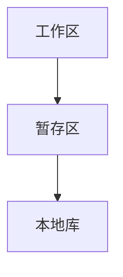

### Git简史

### 本地结构

### 常用命令

| 命令       | 说明                     |
| ---------- | ------------------------ |
| git add    | 添加文件                 |
| git commit | 提交文件                 |
| git status | 查看工作区和暂存区的状态 |
| git log    | 从最近到最远的提交日志   |

